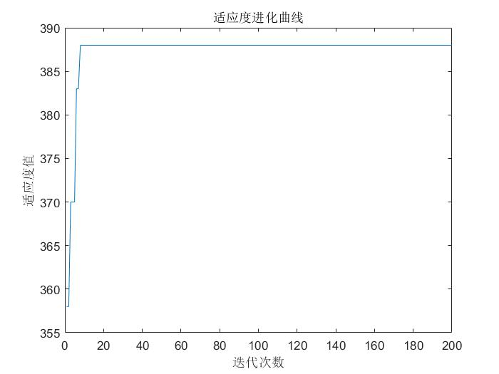

## 粒子群算法(Particle Swarm Optimization,PSO)
#### 定义
粒子群算法是在`对动物集群活动行为观察基础`上，利用`群体中的个体对信息的共享`使整个群体的运动在问题求解空间中产生从无序到有序的演化过程，从而获得最优解。
#### 公式

#### 流程
1. 初始化粒子群
   - 设置 群体粒子个数 N
   - 设置 粒子维度 D
   - 设置 对大迭代次数 T
   - 设置 学习因子 c1 c2
   - 设置 惯性权重最大值、最小值 Wmax Wmin
   - 初始化 群体粒子位置和速度
   - 初始化 粒子最优位置和最优值
   - 初始化 全局最优位置和最优值
2. 计算每个粒子的适应度
3. 更新粒子最优位置和最优值
4. 更新全局最优位置和最优值
5. 迭代更新粒子
   - 计算动态惯性权重值
   - 更新粒子速度值
   - 边界条件处理
   - 更新粒子新位置
6. 判断算法终止条件是否满足

#### 案例一 离散粒子群求0-1背包问题
0-1背包问题。有 N 件物品和一个容量为 V 的背包。第 i 件物品的体积是 c(i)，价值是 w(i)。求解将哪些物品放入背包可使物品的体积综合不超过背包的容量，且价值总和最大。假设物品数量为10，背包的容量为300。每件物品的体积为[95,75,23,73,50,22,6,57,89,98]，价值为[89,59,19,43,100,72,44,16,7,64]。
```MATLAB
% 离散粒子群算法解决0-1背包问题 
% 初始化 
close all;              %清图
clear;                  %清除所有变量
clc;                    %清屏
N=100;                  %群体粒子个数
D=10;                   %粒子维数
T=200;                  %最大迭代次数
c1=1.5;                 %学习因子1
c2=1.5;                 %学习因子2
Wmax=0.8;               %惯性权重最大值
Wmin=0.4;               %惯性权重最小值
Vmax=10;                %速度最大值
Vmin=-10;               %速度最小值
V = 300;                             %背包容量
C = [95,75,23,73,50,22,6,57,89,98];  %物品体积
W = [89,59,19,43,100,72,44,16,7,64]; %物品价值
afa = 2;                             %惩罚函数系数
% 初始化种群个体（限定位置和速度）      
x = randi([0,1],N,D);     %随机获得二进制编码的初始种群
v = rand(N,D) * (Vmax-Vmin)+Vmin;
% 初始化个体最优位置和最优值 
p = x;
pbest = ones(N,1);
for i=1:N
    pbest(i)= func4(x(i,:),C,W,V,afa);
end
% 初始化全局最优位置和最优值 
g = ones(1,D);
gbest = eps;
for i = 1:N
    if(pbest(i) > gbest)
        g = p(i,:);
        gbest = pbest(i);
    end
end
gb=ones(1,T);
% 按照公式依次迭代直到满足精度或者迭代次数 
for i=1:T
    for j=1:N
        % 更新个体最优位置和最优值 
        if (func4(x(j,:),C,W,V,afa) > pbest(j))
            p(j,:) = x(j,:);
            pbest(j) = func4(x(j,:),C,W,V,afa);
        end
        % 更新全局最优位置和最优值 
        if(pbest(j) > gbest)
            g=p(j,:);
            gbest=pbest(j);
        end
        % 计算动态惯性权重值
        w=Wmax-(Wmax-Wmin)*i/T;
        % 跟新位置和速度值
        v(j,:)=w*v(j,:)+c1*rand*(p(j,:)-x(j,:))...
            +c2*rand*(g-x(j,:));
        % 边界条件处理 
        for ii=1:D
            if (v(j,ii)>Vmax)  |  (v(j,ii)< Vmin)
                v(j,ii)=rand * (Vmax-Vmin)+Vmin;
            end
        end    
        vx(j,:)=1./(1+exp(-v(j,:)));
        for jj=1:D
            if vx(j,jj)>rand
                x(j,jj)=1;
            else
                x(j,jj)=0;
            end
        end      
    end
    % 记录历代全局最优值 
    gb(i)=gbest;
end
fprintf('%d\n',g);                       %最优个体 
func4(g,C,W,V,afa)
figure
plot(gb)
xlabel('迭代次数');
ylabel('适应度值');
title('适应度进化曲线')

% 适应度函数 
% 惩罚系数足够大到排除该方案
function result = func4(f,C,W,V,afa)
fit = sum(f.*W);
TotalSize = sum(f.*C);
if TotalSize > V
    fit = fit - afa * (TotalSize - V);
end
result = fit;
end
```
 

#### 思考
- [ ] 初始化参数的选择(粒子个数、粒子维度、迭代次数)？
- [ ] 更新粒子参数的选择(学习因子、惯性权重因子)？
- [ ] 适应度函数(惩罚因子)的制定？
- [ ] 粒子群算法的变体(标准粒子群、压缩因子粒子群、离散粒子群等)？
- [ ] 粒子群算法的不同写法(Python)？
- [x] 本文更新在 2022-8-21 11:23
