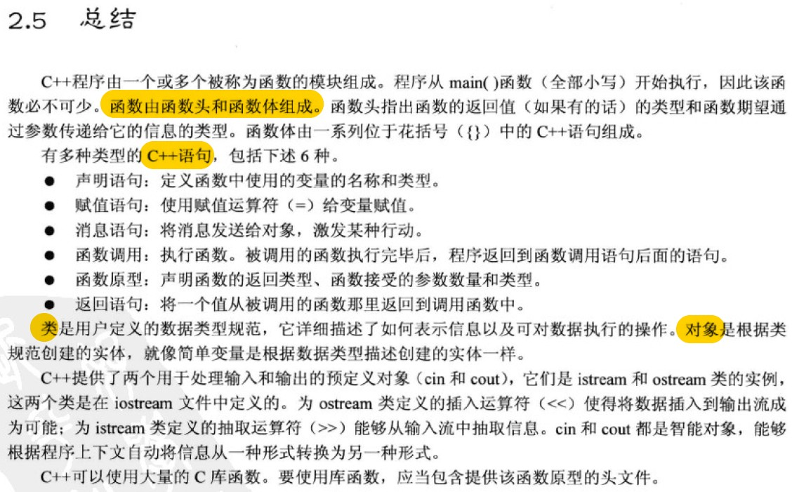

# 《C++ prime plus 第六版》
## 第1章 预备知识
- 小节标题
  - 1.1 C++简介
  - 1.2 C++简史
  - 1.3 可移植性和标准 
  - 1.4 程序创建的技巧
- 知识点总结
  - C++融合了三种不同的编程方式：**过程性语言**、**面向对象语言**、**泛型编程**
  - C++98、C++11
- 重要问题

    Q: 一个C++程序是如何运行起来的（P6）？

    使用**文本编辑器**编写程序，并将其保存到文件中，这个文件是程序的**源代码**。**编译**源代码，即意味着运行一个程序，将源代码翻译为机器语言，包含了翻译后的程序文件是程序的**目标代码**(objct code)。将目标代码与其他代码**链接**起来，链接指的是将目标代码同时用的函数的目标代码以及一些标准的启动代码(startup code)组合起来，生成程序的运行阶段版本，包含该最终产品的文件被称为**可执行文件**。

    

## 第2章 开始学习C++
- 小节标题
  - 2.1 开始学习C++
  - 2.2 C++语句
  - 2.3 其他C++语句
  - 2.4 函数
- 知识点总结
  - `# incldue <iostream>` 编译指令导致预处理器将iostream头文件的内容添加到程序中，使用cin和cout进行输入和输出的程序必须包含文件iostream
  - `using namespace std`表示可以使用名称空间std中的所有名称，但更好的方法是只使用所需的名称，如`using std::cout`
  
    

  - 一行代码中不可分割的元素叫做**标记**。空白、制表符、和回车统称为**空白**，通常，必须用空白将标记分开。
  - 对于声明变量，C++的做法是尽可能在首次使用变量前声明它，函数原型之于函数就像变量声明之于变量——指出涉及的类型。
  - **函数**由函数头和函数体组成。**函数头**指出函数的返回值类型和函数期望通过参数传递给它的信息类型。**函数体**由一系列位于花括号中的C++语句组成。**参数**是发送给函数的信息，**返回值**是从函数中发送回去的值
  - 在有些语言中，有返回值的函数被称为函数(function)；没有返回值的函数被称为过程(procedure)或子程序(subroutine)，但C++和C一样都称为函数。
  - main()返回一个int值，而程序员要求它返回整数0
  - 程序员有时将函数比作一个由出入他们信息所指定的黑盒子(black boxes)(电工用语)
    
    

## 第9章 内存模型和名称空间
- 小节标题
- 知识点总结
    - 基于预处理器编译指令#ifndef(即if not define)是避免多次包含同一头文件的标准C/C++技术


## 第10章 对象和类
- 小节标题
  - 10.1 过程性编程和面向对象编程
  - 10.2 抽象和类
  - 10.3 类的构造函数和析构函数
  - 10.4 this指针
  - 10.5 对象数组
  - 10.6 类作用域
  - 10.7 抽象数据类型

- 知识点总结
    - **类**是用户定义的类型，**对象**是类的实例。一般来说，私有**数据成员**存储信息，公有**成员函数**(又称为**方法**)提供访问数据的唯一途径。
    - **作用域解析运算符** :: 、**成员运算法符**. 、**客户/服务器模型**
    - 通常用 :: 将类成员函数在类内声明，在类外定义，声明与定义放在不同的文件，实现封装。
    - 当且仅当没有定义任何构造函数时，编译器才会提供默认**构造函数**。
    - 如果既可以通过初始化，也可以通过赋值来调用构造函数设置对象的值，应采用初始化方法，通常这种方法效率最高。
    ```
        Stock Stock1('A', 9, 20.0)  //隐式调用构造函数
        Stock Stock2 = Stock('B', 3, 20.0)   //显式调用构造函数(可能会创建临时对象)
        Stock *pstock = new Stock('C', 18, 19.0)  //动态分配内存调用构造函数
        Stock3 = Stock('B', 3, 20.0)  //赋值(总会创建临时对象)
    ```
  - 如果构造函数使用了new，则必须使用delete的**析构函数**。
  - 只要类方法不修改调用对象，就应将其声明为const，放在函数括号后面。
  - 每个成员函数(包括构造和析构)都有一个this指针，指向调用对象。
  - 可以使用关键字static在类作用域内定义常量。
  - 通常使用类表示更通用的概念，比如**抽象数据类型**(abstract data type, ADT)


