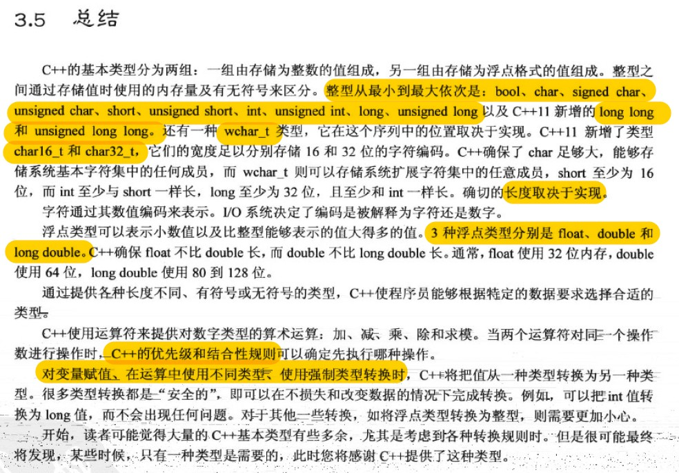
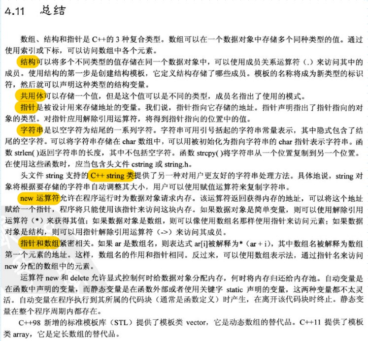
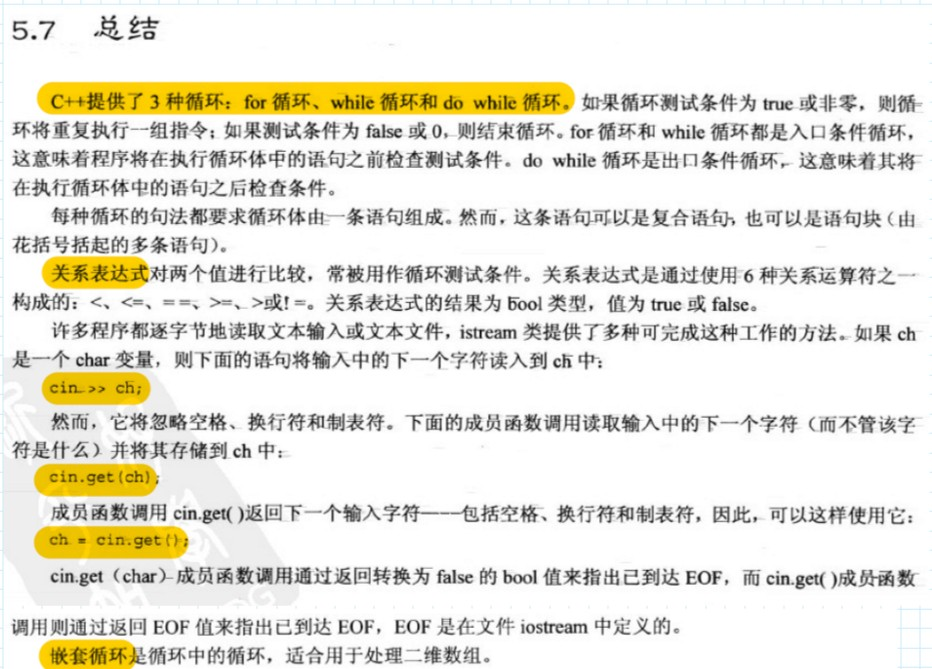
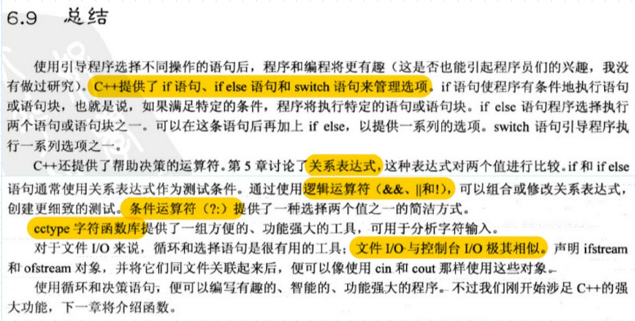

# 《C++ prime plus 第六版》
## 目录
[第1章 预备知识](#第1章-预备知识)  
[第2章 开始学习C++](#第2章-开始学习c)  
[第3章 处理数据](#第3章-处理数据)   
[第4章 复合类型](#第4章-复合类型)   
[第5章 循环和关系表达式](#第5章-循环和关系表达式)
[第6章 分支语句和逻辑运算符](#第6章-分支语句和逻辑运算符)  
[第7章 函数 C++的编程模块](#第7章-函数-c的编程模块)  
[第8章 函数探幽](#第8章-函数探幽)
[第9章 内存模型和名称空间](#第9章-内存模型和名称空间)  
[第10章 对象和类](#第10章-对象和类)  
[第16章 string类和标准模板库](#第16章-string类和标准模板库)   
[第17章 输入、输出和文件](#第17章-输入输出和文件)   
[实际程序问题](#实际程序问题)   
[总结](#总结)    

## 第1章 预备知识

### 参考小节

- 1.1 C++简介
- 1.2 C++简史
- 1.3 可移植性和标准 
- 1.4 程序创建的技巧

### 知识点

- C++融合了三种不同的编程方式：**过程性语言**、**面向对象语言**、**泛型编程**
- C目前标准：C99，C11；C++目前标准：C++98、C++11
- 集成开发环境(IDE)、命令行环境

  

### 问题

Q: 一个C++程序是如何运行起来的（P6）？

:memo:使用**文本编辑器**编写程序，并将其保存到文件中，这个文件是程序的**源代码**。**编译**源代码，即意味着运行一个程序，将源代码翻译为机器语言，包含了翻译后的程序文件是程序的**目标代码**(objct code)。将目标代码与其他代码**链接**起来，链接指的是将目标代码和使用函数的目标代码以及一些标准的启动代码(startup code)组合起来，生成程序的运行阶段版本，包含该最终产品的文件被称为**可执行文件**。


Q: Linux中的编译和链接是什么样的（P8）？

## 第2章 开始学习C++

### 参考小节

- 2.1 开始学习C++
- 2.2 C++语句
- 2.3 其他C++语句
- 2.4 函数

### 知识点

- `#incldue <iostream>` 编译指令导致**预处理器**将iostream头文件的内容添加到程序中，使用cin和cout进行输入和输出的程序必须包含文件iostream
- `#include <file>`编译程序会先到标准函数库中找文件；`#include "file" `编译程序会先从当前目录中找文件
- `using namespace std`表示可以使用名称空间std中的所有名称，但更好的方法是只使用所需的名称，如`using std::cout`

  

- 一行代码中不可分割的元素叫做**标记**。空白、制表符、和回车统称为**空白**，通常，必须用空白将标记分开。
- 对于声明变量，C++的做法是尽可能在首次使用变量前声明它，**函数原型**之于函数就像**变量声明**之于变量——指出涉及的类型。
- **函数**由函数头和函数体组成。**函数头**指出函数的返回值类型和函数期望通过参数传递给它的信息类型。**函数体**由一系列位于花括号中的C++语句组成。**参数**是发送给函数的信息，**返回值**是从函数中发送回去的值
- 在有些语言中，有返回值的函数被称为函数(function)；没有返回值的函数被称为过程(procedure)或子程序(subroutine)，但C++和C一样都称为函数。
- main()返回一个int值，而程序员要求它返回整数0
- 程序员有时将函数比作一个由出入他们信息所指定的黑盒子(black boxes)(电工用语)
  
  


## 第3章 处理数据

### 参考小节
  - 3.1 简单变量
  - 3.2 const 限定符
  - 3.3 浮点数
  - 3.4 C++算术运算符


### 知识点
  - C++ 将符号整型和无符号整型统称为整型；**整型**和**浮点型**统称为算数 (arithmetic) 类型。char在默认情况下既不是有符号，也不是无符号。
  - 如果不对函数内部定义的变量进行初始化，该变量的值将是不确定的
  - C++对**字符**使用单引号，对字符串使用双引号
  - C++中**通用字符名**(universal character name)用法类似于**转义序列**，以`\u \U`打头，\u 后跟4个16进制位，\U后跟8个16进制位
  - C++ const 比 #define 好，首先它明确指定类型；其次可以使用C++作用域规则将定义限制在特定的函数或文件中
  - C++没有提供自动超出整数限制的功能，可以使用头文件 `climits.h` 来确定限制情况

    

- 可查阅问题
  Q: C++变量命名规则？(P33)  
  Q: C++整型变量长度标准？(P34)  
  Q: C++11提供的大括号初始化称为**列表初始化**？(P37) :art:     
  Q: wchar_t，以及C++11新增的char16_t和char32_t的使用?（P45） :art:     
  Q: **类型转换**?（P53-56）C++11 编译器在算术表达式中执行转换遵循的校验表？(P55)  
  Q: 下面两条 C++ 语句 `char grade = 65` `char grade = 'A'`是否等价？(P57 复习题 5)  
  Q: 将 long 值赋给 double 变量和将 long long 变量赋给 double会有舍入误差么？(P58 复习题 7)   

  Q：ASCII码、Unicode码、UTF-8的关系？
  :memo:ASCII码是Unicode码的子集，可以用通用字符名来表示Unicode多出的特殊字符。ASCII码在计算机中可以用一位储存，而Unicode不止一位，就有了许多编码方式，最常用的就是UTF-8编码格式，这种编码方案字符可能存储为1-4个字节。超出一字节的字符可以用 wchar_t, char16_t, char_t 类型来定义。

## 第4章 复合类型

### 参考小节
  - 4.1 数组
  - 4.2 字符串
  - 4.3 string类简介
  - 4.4 结构简介
  - 4.5 4.6 共用体 & 枚举


### 知识点

  - 编译器不会检查使用的数组下标(或索引)是否有效，但程序运行后可能会引发问题
  - C++11前 **数组** 就支持列表初始化，列表初始化禁止缩窄转换，数组之间无法互相赋值；C++11支持 **结构** 列表初始化，同类型结构之间可以相互赋值
  - C++处理字符串的方式有两种，第一种来自C语言，常被称为C风格字符串(C-style string)`cstring.h <strcmp(),strcpy(),strlen(),strcat()...>`；第二种是基于string类库的方法`string.h <str.size()...>`
  - 字符串存储到数组中有两种方法，将数组初始化为字符串常量、将键盘或文件输入到数组中。`cin—按词读取, cin.getline()—按行读取丢弃换行符, cin.get()—按行读取保留换行符`


### 参考小节
  - 4.7 指针和自由存储空间
  - 4.8 指针，数组和指针算术
  - 4.9 类型组合
  - 4.10 数组的替代品

### 知识点
  -  **地址运算符** `&`；**间接值或解除引用运算符**(indirect value)(dereferencing) `*`。变量 x 是值，能用 & 获得地址；指针 p 是地址，能用 * 获得值。
  -  C++在类型一致方面要求更严格，应通过强制类型转换将数字转换为适当的地址类型，如 `p = (int *) 0xB8000000`
  -  变量是在编译时分配有名称的内存，**指针**适合在运行阶段分配未命名的内存以存储值 `C:malloc(),C++:new()`
  -  在编译时给数组分配内存称为静态联编(static binding)；在程序运行时选择数组的长度称为动态联编(dynamic binding)，这种数组叫做动态数组(dynamic array)。
  - C++将数组名被解释为数组第一个元素的地址；在cout和多数C++表达式中，char数组名、char指针以及引号括起的字符串常量都被解释为字符串第一个字符的地址
  - 数组和指针的区别之一是，可以修改指针的值，而数组名是常量；另一个区别是对数组用sizeof运算符得到的是数组的长度，对指针用是指针的长度
  - 数组的地址：以 `short a[10]` 为例，`&a[0]/a` 和 `&a` 从数字上说地址相同；在概念上 `&a[0]/a` 是两字节的内存块地址，`&a` 是20字节的内存块地址
  - **箭头成员运算符** `->`，如果结构标识符是结构名，使用句点运算符；如果标识符是指向结构的指针，则使用箭头运算符。`p->price 与 (*p).price 等价`

    

- 可查阅问题
  Q: 数组初始化规则？（P61-62）  
  Q: C风格字符串的处理方式是什么样的 (如何用数组处理字符串)？(P62-68) :star:   
  Q: **共用体**的用法？（P78）**枚举**的用法？(P79-80)  
  Q: 使用 new 和 delete 的规则？（P87）  
  Q：指针和数组基本等价的使用小结？（P90-P91）:star:  
  Q: 指针和数组的特殊关系扩展到 C 风格字符串(如何用指针处理字符串)？(P92-P93) :star:  
  Q: 内存泄漏？(P97)  


## 第5章 循环和关系表达式

### 参考小节
- 5.1 5.2 5.3 for循环 & while 循环 & do while 循环
- 5.4 基于范围的 for 循环
- 5.5 嵌套循环和二维数组

### 知识点
- C++中将C风格字符串视为地址，关系运算符比较两个字符串无法获得满意的结果`strcmp()函数`；string 类用运算符重载帮助比较两个字符串
- 逐字符遍历字符串直到遇到空值字符的技术是C++处理C风格字符串的标准方法
- 头文件 `ctime` 中定义了一个符号常量 CLOCKS_PER_SEC，该常量等于每秒钟包含的系统时间单位数，将系统时间除以这个值可以得到秒数
- 引用是C++在C语言的基础上新增的一种类型
- C++规定逗号表达式的值是第二部分的值

  

### 问题
Q: for 循环和 while 循环存在三个差别？(P122)
Q: C++为类型创建别名的有两种方式(预处理器，typedef)？（P123）
Q: C++11 新增的一种基于范围的循环如何使用？（P125） :art: 
Q: 用键盘输入模仿文件尾条件(Unix下式Ctrl+D, Windows下是Crtl+Z和Enter)？（P128）
Q: 获取输入中的一个字符 (cin.get的两种用法)？（P131）  
> 通常，编写清晰、容易理解的代码比使用语言的晦涩特性来显示自己的能力更为有用


## 第6章 分支语句和逻辑运算符

### 参考小节
- 6.1 if 语句
- 6.2 逻辑表达式
- 6.3 字符函数库 ctype
- 6.4 ?:运算符
- 6.5 switch 语句
- 6.6 break 和 continue 语句
- 6.7 读取数字的循环
- 6.8 简单文件输入输出

### 知识点
- C++运算符的优先级规则常可能不使用括号便可以编写符合比较的语句，但最简单的方法还是用括号将测试进行分组，而不管是否需要括号
- and, or, not 并非 C语言中的保留字，如果需要当作运算符，需要包含头文件 `iso646.h`
- 条件运算符 `?:` 是C++中唯一一个需要三个操作数的运算符，适合于简单关系和简单表达式的值
- switch 测试条件必须是一个结果为整数值的表达式，每个标签必须是整数常量表达式(字符标签比数字标签要好)；case 标签只是行标签，而不是选项之间的界线；
- switch 并不是为处理取值范围而设计的，如果既可以使用 if else 也可以使用 switch 语句，则当选项不少于三个时，应使用 switch 语句
- 使用 cin 输入时，一开始都是字符数据(文本数据)，然后 cin 对象负责将文本转换为其他类型

  

### 问题
Q: C++从C语言继承了一个字符函数库(cctype)，库中常用的一些函数？（P148）
Q: 将枚举量用作 switch 语句的标签？（P151）
Q: cin 输入的特点？（P157）
Q: 控制台输入输出和文件输入输出的要点？ （P158-159）

## 第7章 函数 C++的编程模块

### 知识点
- C++的编程风格是将main()放在最前面，因为它通常提供了程序的整体结构
- 在C++中，原型是不可选的，即必须要有原型，以确保不会发生错误
- 在C++中括号为空与在括号中使用关键词void是等效的，意味着函数没有参数，不指定参数列表时应使用省略号；在ANSI C中，括号为空意味着不指出参数，意味着在后面定义参数列表
- C++标准使用参数来表示**实参(argument)**，使用参量来表示**形参(parameter)**
- C++中当且仅当用于函数头或函数原型中，`int *arr` 和 `int arr[]` 的含义是相同的。当指针指向数组的第一个元素时，可以使用数组表示法，当指向一个独立值时，使用指针表示法
- 传统的C/C++方法是，将指向数组起始处的指针作为第一个参数，将数组长度作为第二个参数(指针指出数组的位置和数据类型)；还有另一种是指定元素区间，传递两个指针，一个指针标识数组开头，一个指针标识数组尾部
- `const int *p = &age` 不能使用指针修改指向值，但是指针可以指向新的地址；`int * const p = &age` 能使用指针修改指向值，但是指针不能指向新的地址

> 首先考虑的是通过数据类型和设计适当的函数来处理数据，然后将这些函数组合成一个程序，有时也称为自上而下的程序设计(bottom-up programming)，因为设计过程从组建到整体运行，这很适合OOP，它强调的是数据表示和操纵。

### 问题
Q: C++和C原型的区别？(P171)
Q：指针和const结合使用(函数指针参数尽可能使用const的原因)？（P183）:star:
## 第8章 函数探幽

## 第9章 内存模型和名称空间

### 参考小节

- 9.1 单独编译
- 9.2 存储持续性、作用域和链接性
- 9.3 名称空间

### 知识点

- 基于预处理器编译指令#ifndef(即if not define)是避免多次包含同一头文件的标准C/C++技术
- **存储持续性**，即存储类别如何影响在文件间的共享；**作用域**(scope)描述了名称在文件(翻译单元 translation unit)的多大范围可见；**链接性**(linkage)描述了名称如何在不同单元间共享
- **自动存储持续性**，在程序开始执行其所属的函数或代码块时被创建，在执行完函数或代码块时，它们使用的内存被释放；**静态存储持续性**，在程序整个执行过程中都存在。
- 链接性为外部的变量通常简称为外部变量，它们的存储持续性为静态，作用域为整个文件，也称**全局变量**.
- 在多文件程序中，可以在一个文件中（且只能在一个文件中）定义一个外部变量，使用该变量的其他文件必须使用关键字extern声明它。
- 编译器使用三块独立的内存：一块用于静态变量，一块用于自动变量（栈 stack），另外一块用于动态储存(堆 heap 或 自由存储区 free store)
- 有些被称为**存储说明符**(storge class specifier)或**cv-限定符**(cv-specifier)的C++关键词提供了其他有关存储的信息
- 在默认情况下全局变量的链接性是外部的，但 const 全局变量的链接性为内部的
- C++是通过定义一种新的`声明区域`来创建命名的**名称空间**，以减少名称冲突

  

### 问题
Q: C++中的四种存储持续性？(P250)    
Q: C++11中 auto (P56) 和 register (P252) 的作用发生什么变化？:art:   
Q: 不引入名称空间的存储特性？静态持续变量的三种链接性？static关键词在静态持续变量中两种用法？静态变量的静态和动态初始化是什么？(如何使用关键词 static)(P254) :star:  
Q: 存储说明符和cv-限定符的作用(const对存储类型的影响)(如何使用关键字const)？(P260) :star:  


## 第10章 对象和类

### 参考小节

- 10.1 过程性编程和面向对象编程
- 10.2 抽象和类
- 10.3 类的构造函数和析构函数
- 10.4 this指针
- 10.5 对象数组
- 10.6 类作用域
- 10.7 抽象数据类型

### 知识点总结

- **类**是用户定义的类型，**对象**是类的实例。一般来说，私有**数据成员**存储信息，公有**成员函数**(又称为**方法**)提供访问数据的唯一途径。
- **作用域解析运算符** `::` 、**成员运算法符** `.` 、**客户/服务器模型**
- 通常用 :: 将类成员函数在类内声明，在类外定义，声明与定义放在不同的文件，实现封装。
- 当且仅当没有定义任何构造函数时，编译器才会提供默认**构造函数**。
- 如果既可以通过初始化，也可以通过赋值来调用构造函数设置对象的值，应采用初始化方法，通常这种方法效率最高。

  ```
      Stock Stock1('A', 9, 20.0)  //隐式调用构造函数
      Stock Stock2 = Stock('B', 3, 20.0)   //显式调用构造函数(可能会创建临时对象)
      Stock *pstock = new Stock('C', 18, 19.0)  //动态分配内存调用构造函数
      Stock3 = Stock('B', 3, 20.0)  //赋值(总会创建临时对象)
  ```

- 如果构造函数使用了new，则必须使用delete的**析构函数**。
- 只要类方法不修改调用对象，就应将其声明为const，放在函数括号后面。`void Stock()::show() const`
- 每个成员函数(包括构造和析构)都有一个this指针，指向调用对象。
- 可以使用关键字static在类作用域内定义常量，这样的常量被所有创建对象共享
- 通常使用类表示更通用的概念，比如**抽象数据类型**(abstract data type, ADT)
### 问题
Q: C++使用构造函数来初始化对象的方式？（P289）
Q: 构造函数和析构函数小结？（P296）

## 第11章 使用类

## 第16章 string类和标准模板库

## 第17章 输入、输出和文件

### 参考小节
- 17.1 C++输入和输出概述
- 17.2 使用cout进行输出
- 17.3 使用cin进行输入
- 17.4 文件输入和输出
- 17.5 内核格式化

### 知识点
- 正如C实现含 stdio.h (C++中是 cstdio) 的标准函数库一样，C++也自带了一个含 iostream 的标准类库
- 对象代表**流**意味着，当iostream文件为程序声明一个cout对象时，该对象包含存储了与输出有关的信息的数据成员，如数据使用的字段宽度，小数位数，显示整数时采用的计数方式以及描述用来处理输出流的**缓冲区**的 streambuf 对象地址
- 标准输入输出流通常连接着键盘和屏幕，很多操作系统(含Unix,Linux,Windows)都支持重定向，能够改变标准输入和输出
- C++有一种在命令行环境中运行的程序能够访问命令行参数的机制 `int main(int argc, char *argv[])`

### 问题
Q: 如何理解流？(P596) 如何理解缓冲区?（P594）输入和输出流都需要两个连接？(输入输出重定向 `<` `>`） (P593) cerr,clog对象对应的标准错误流如何使用？(P596)
Q: C和C++的文件打开模式？(P627-628)

## 实际程序问题

### 问题一
假设程序要存储1000个字符串，其中最长的字符串有79个字符，大多数字符串都短得多。此时有两种方案：方案一是全部是字符数组，这样有1000个数组，每个数组有80个字符，共80000个字节，很多内存都未被使用；方案二是创建一个包含1000个指向char的数组，然后使用new根据每个字符串的长度分配响应的内存，这将节省几万个内存。

**:star:要点** 
- 处理字符串(C风格字符串法) `strlen(),strcpy(),strcat()`
- 数组存储字符串 `char a[10] = "Hello!";` 
- 获取输入字符串`cin, cin.getline(name, Arsize), cin.get(name, Arsize), cin.get()`
- 指针存储字符串 `char *p = "Hello!";`
- 数组和指针的特殊关系；`*(stacks + 1) <=> stacks[1]` 
- 创建动态结构 `char *p = new char[strlen(s)+1];` `delete [] p;`

**:memo:程序**
``` C++
  /* save storage */
  const int Arsize = 80;              // enough wide to store string
  char temp[Arsize];                  // temporary storage 
  cin.getline(temp, Arsize);          // get a line input
  char *pn = new char[strlen(temp)+1];// new
  strcpy(pn, temp)                    // copy string into smaller space
  ...                                 // ...
  delete [] pn;                       // delete
```
### 问题二
假设程序要求从文本文件中读取数据，这些信息储存在一个动态分配的结构数组中。每个结构有两个成员，储存姓名的字符数组和浮点型的存款。文本第一行是总人数，下面每一对行中，第一行是姓名，第二行是钱款，文件类似于下面。
``` txt
4
Sam Stone
2000
Freida Flass
10050
Tammy Tubbs
5000
Rich Raptor
8000
```
**:star:要点：** 
- 文件打开 `open(), is_open()`
- 输入对象的基本使用(cin) `inFile >> num; inFile.get()` 

**:memo:程序：** 
``` C++
  /* read textfile*/
  ifstream inFile;
  inFile.open(path);
  if (!inFile.is_open())
  {
    cout << "Could not the file" << path << endl;
    exit(EXIT_FAILURE);
  }

  int num;
  inFile >> num;
  inFile.get();
  for (int i = 0; i < num; i++)
  {
    inFile.getline((p + i)->name, Arsize);
    inFile >> (p + i)->money;
    inFile.get();
  }
```

## 总结
- [x] github网页暂不支持`[toc]`语法，故使用网页锚点做页面内链接跳转

- [x] 目前学习顺序：
- 第1章第2章(初识C++)
- 第10章(了解面向对象的设计思想)
- 第9章(有助于多文件编程)
- 第3章第4章(掌握基本类型和复合类型)
- 第17章(学会文件输入输出方式)
- 第5章第6章(掌握了最基本编程)
- ...

- [x] 处理数据的演变
- 整型(为了存储各种长度的整数，存储字符，存储布尔值)
- 浮点型(为了存储各种长度的小数)
- 数组(为了存储多个同类型的数据)
  - 字符数组 或 string类(为了处理字符串操作)
  - vector类 或 C++11 array类(动态数组和定长数组的替代品)
- 结构(为了存储多个不同类型的数据)
- 共用体(为了节省内存) 
- 指针(为了跟踪数据的地址)
- 关键字typedef(为了给类型创建别名)
- 分支和循环(为了控制程序流程)
- 函数(为了处理特定的数据操作)
- ...

- [x] C++（相较C）用类在哪些地方进行了改进？
- 处理字符串 用了string类
- 文件输入输出 用了fstream类
- ...

- [ ] 缺少一个C++/C打开文件的实际程序用例