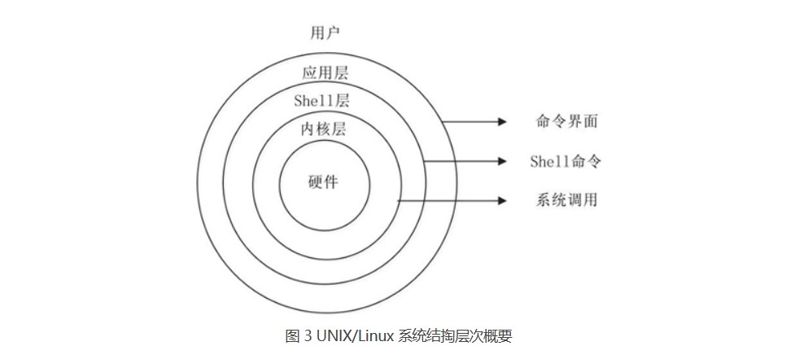
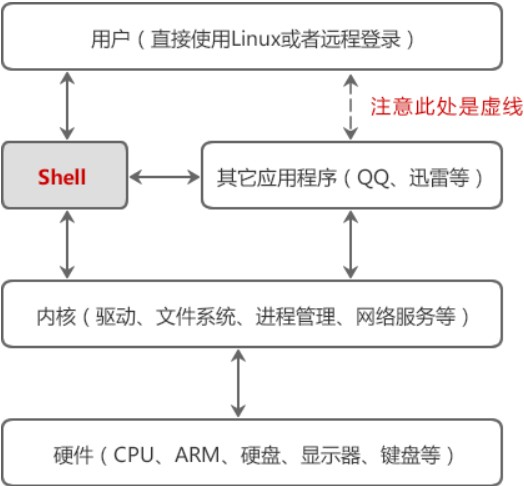
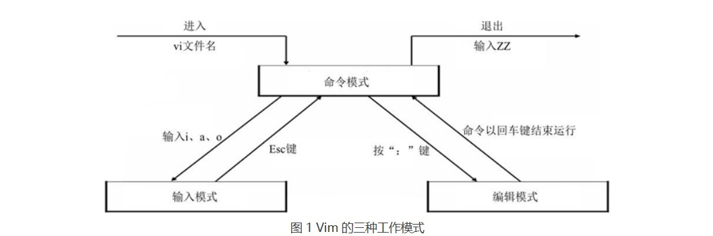
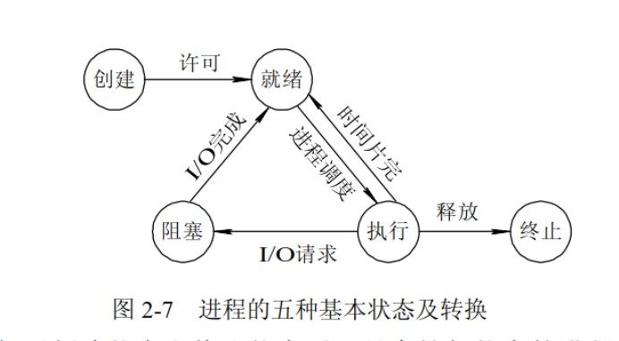
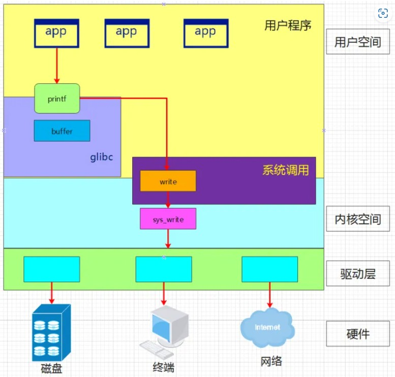
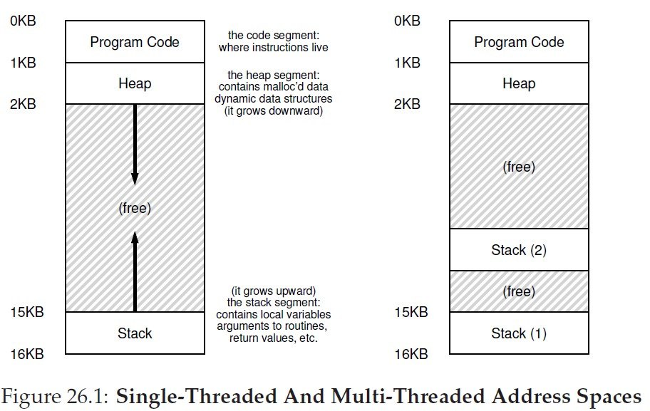

# 引言

## 目录

[安装 wsl (Windows Subsystem for Linux)](#安装-wsl-windows-subsystem-for-linux)  
[Terminal 和 VScode](#terminal-和-vscode)  
[Unix 和 Linux](#unix-和-linux)  
[安装gcc/g++(Ubantu)](#安装-gccgubantu)  
[熟悉基础命令行工具](#熟悉基础命令行工具)  
[配置自己的环境](#配置自己的环境)  
[进程与线程](#进程与线程)  
[并发与并行](#并发与并行)     
[库函数和系统调用](#库函数和系统调用)   
[main()函数的参数](#main函数的参数)     
[总结](#总结)

## 安装 wsl (Windows Subsystem for Linux)
https://www.bilibili.com/video/BV1aA411s7PJ/  
wsl 安装成功视频 —— b站   
https://learn.microsoft.com/en-us/windows/wsl/  
wsl 官方安装文档 —— 官网

## Terminal 和 VScode
在Microsoft store中安装Windows terminal，它是适用于**命令提示符**，**Powershell**，**wsl**等的终端应用程序。

- [x] 这样就可以实现在Windows下编辑代码，在Linux下编译运行的效果；链接到 VScode 后新建终端和外部终端（保持打开）作用一样

## Unix 和 Linux
http://c.biancheng.net/view/707.html  
Linux和Unix的关系及区别——C语言中文网 

UNIX 操作系统由肯•汤普森（Ken Thompson）和丹尼斯•里奇（Dennis Ritchie）发明。后来由芬兰人林纳斯·托瓦兹（Linus Torvalds）写了新的操作系统 Linux，它与 Unix 在外观和交互上类似，故也称是类 Unix 系统。Linux 开源后与缺少内核的 GNU 打包发布，故也称 GNU/Linux，后来大家省略 GNU 叫的 Linux 其实是类 Uinx 的内核和大量 GNU 开源软件的一个集合体。



Linux 发行版说简单点就是将 Linux 内核与应用软件进行一个打包，目前市面上知名的发行版有 Ubantu、CentOS 等等。

## 安装 gcc/g++（Ubantu）
Linux 下使用最广泛的 C/C++ 编译器是 gcc/g++，大多数的 Linux 发行版本都默认安装。

apt（Advanced Packaging Tool）是一个在 Debian 和 Ubuntu 中的 Shell 前端软件包管理器。
```
sudo apt update                     列出所有可更新的软件清单命令
sudo apt upgrade                    升级软件包
sudo apt install <package_name>     安装指定软件命令
sudo apt autoremove                 清理不再使用的依赖和库文件
!!! 安装失败考虑旧版命令 apt-get
```

默认的 Ubuntu 软件源仓库中包含了一个软件包组，名称为 `build-essential`，它包含了 GNU 编辑器集合，GNU 调试器，和其他编译软件所必需的开发库和工具。很多开源项目包括 Linux kernel 和 GNU 工具，都是使用 gcc 进行编译的。GNU 编译器集合是一系列用于语言开发的编译器和库的集合，包括: C, C++, Objective-C, Fortran, Ada, Go, and D等编程语言。
```
sudo apt install bulid-essential    安装 bulid-essential
gcc --version                       打印 gcc 版本验证是否安装成功
```

https://blog.csdn.net/weixin_44718794/article/details/106751513  
wsl 链接到 VScode 编写 C/C++代码 检测到 #include 错误解决办法 —— CSDN

https://zhuanlan.zhihu.com/p/404682058  
Linux gcc/g++ 使用讲解 —— 知乎

- [x] 这样就掌握了在Linux下结合VScode编辑编译链接C/C++代码的技能
- [x] Linux内核大部分是用C语言编写的，还有部分是用汇编语言写的，因为在对于硬件上，汇编有更好的性能和速度。
- [x] Linux一个文件是否能被执行，和后缀名没有太大的关系，主要看文件的属性有关

## 熟悉基础命令行工具

- **tldr** = Too Long; Didn't Read，它简化了烦琐的man指令帮助文档，仅列出常用的该指令的使用方法。相比较man给出完整的帮助文档而言，大多数情况下，给出几个指令的使用demo可能正是我们想要的。

  https://github.com/tldr-pages/tldr 
  tldr —— github

  ```
      sudo apt install nodejs     安装 Node.js（JavaScript的运行环境）
      sudo apt install npm        安装 npm（Node.js官方提供的包管理工具）
      npm install -g tldr         安装 tldr
  ```
- **Git** 软件包被包含在 Ubuntu 默认的软件源仓库中，并且可以使用 apt 包管理工具安装。
  ```
      sudo apt install git        安装 git
      git --version               查看 git 版本
  ```
- **GNU make** 在 Linux（unix ）环境下使用GNU 的make工具能够比较容易的构建一个属于你自己的工程，整个工程的编译只需要一个命令就可以完成编译、连接以至于最后的执行。不过这需要我们投入一些时间去完成一个或者多个称之为Makefile 文件的编写。

- [x] 安装tldr有助于帮助更好的阅读文档；git有助于更好的版本管理；GNU make有助于构建工程；GNU make, bash, gcc, libc 属于是 GNU 免费软件，tldr, tmux 是 github 社区开源软件

## 配置自己的环境

- **Shell** 是一个应用程序，它连接了用户和 Linux 内核，让用户能够更加高效、安全、低成本地使用 Linux 内核，这就是 Shell 的本质。**bash**(**B**ourne **A**gain **Sh**ell)，由GNU开发的Shell，是各种Linux发行版标准配置的Shell。Fish（**F**riendly **I**nteractive **Sh**ell）最大特点就是方便易用，很多其他 Shell 需要配置才有的功能，Fish 默认提供，不需要任何配置。

    

    Shell中输入的命令，有内置命令(cd,pwd等)，也有其他应用程序（一个程序就是一个命令），叫外部命令。
    
    ```  
     echo $SHELL    查看当前使用的shell
     echo $0        查看当前使用的shell
     sudo apt install fish      安装 fish shell
     fish/exit      进入fish/退出fish
     !!! 考虑bash和fish的不同，不设置fish为默认shell
    ```

    http://c.biancheng.net/view/706.html   
    什么是Shell —— C语言中文网 

- **Tmux** 是一个终端复用器（terminal multiplexer），非常有用，属于常用的开发工具。命令行的典型使用方式是，打开一个终端窗口（terminal window，以下简称"窗口"），在里面输入命令。用户与计算机的这种临时的交互，称为一次"会话"（session） 。会话的一个重要特点是，窗口与其中启动的进程是连在一起的。打开窗口，会话开始；关闭窗口，会话结束，会话内部的进程也会随之终止，不管有没有运行完。Tmux 就是会话与窗口的"解绑"工具，将它们彻底分离。


- **Vim** 是一个基于文本界面的编辑工具，使用简单且功能强大。更重要的是，Vim 是所有 Linux 发行版本默认的文本编辑器。Linux Vim有三种工作模式（命令模式、输入模式和编辑模式）。
    

    http://c.biancheng.net/linux_tutorial/40/  
    Vim文本编辑器 —— C语言中文网

- [x] 操作系统中常见的应用程序有Core Utilities (coreutils)（命令有cat，ls等）、系统/工具程序（bash,apt,vim,tmux,python等）、其他应用程序（浏览器、播放器等）

## 进程与线程

**进程**是资源分配的最小单位，**线程**是CPU调度的最小单位。进程间资源不共享，同类线程是共享同一进程分配的资源的。

:memo:Linux中查看进程用ps命令，windows中打开任务管理器

一个进程崩溃后，在保护模式下不会对其他进程产生影响，但是一个线程崩溃整个进程都死掉。所以多进程要比多线程健壮。每个独立的进程有程序运行的入口、顺序执行序列和程序出口。但是线程不能独立执行，必须依存在应用程序中，由应用程序提供多个线程执行控制，两者均可并发执行。

**临界区**指的是一个访问共用资源（例如：共用设备或是共用存储器）的程序片段，而这些共用资源又无法同时被多个线程访问的特性。 

每一个进程都有一个**进程号**（PID, Process Identification），进程号是一个正数，用以唯一标识系统中的某个进程。一个进程创建的另一个新进程称为子进程相反地，创建子进程的进程称为父进程。创建进程会不断递增进程号，全部使用完后会循环回一定值重新递增。Linux中PID分别是0,1(init),2的进程会在OS启动之后一直运行直到关机OS结束运行。




## 并发与并行

所谓**并发**，就是通过一种算法将 CPU 资源合理地分配给多个任务，当一个任务执行 I/O 操作时（I/O操作是相当耗时的），CPU 可以转而执行其它的任务，等到 I/O 操作完成以后，或者新的任务遇到 I/O 操作时，CPU 再回到原来的任务继续执行。

并发是针对单核 CPU 提出的，而**并行**则是针对多核 CPU 提出的。多核 CPU 的每个核心都可以独立地执行一个任务，而且多个核心之间不会相互干扰。在不同核心上执行的多个任务，是真正地同时运行，这种状态就叫做并行。

http://c.biancheng.net/view/9486.html
并发与并行的区别 —— C语言中文网


## 库函数和系统调用

系统调用是为了方便使用操作系统的接口，而库函数则是为了人们编程的方便。库函数调用与系统类型无关，不同的系统，调用库函数，库函数会针对系统调用不同的底层函数实现，因此可移植性好。

glibc是linux下面c标准库的实现，即GNU C Library。  
printf函数、glibc库和系统调用在系统中关系图如下：


## main()函数的参数

C 编译器允许main()函数没有参数，或者有两个参数（有些实现允许更多的参数，但这只是对标准的扩展）。这两个参数，一个是int类型，一个是字符串类型。第一个参数是命令行中的字符串数。按照惯例（但不是必须的），这个int参数被称为argc（argument count）。第二个参数是一个指向字符串的指针数组。命令行中的每个字符串被存储到内存中，并且分配一个指针指向它。按照惯例，这个指针数组被称为argv（argument value）。系统使用空格把各个字符串格开。一般情况下，把程序本身的名字赋值给argv[0]。

## 总结

**心路历程 2023-1-13 20:30**

- 想在Linux环境下编程，在命令行环境下编写C、C++、Python，`安装WSL，Terminal`;
- 想知道 Linux 是什么，为什么要学它， `Unix 和 Linux的关系`;
- 想配置出适合编程的命令行环境，`gcc,tldr,tmux,vim,make,git的基本使用`;
- 想知道编写的程序和操作系统是如何联系的，`库函数和系统调用`
- 想开始学习操作系统的并发 `并发和并行 进程和线程`

---

# 并发 

## 内存模型



当程序运行时(进程)，操作系统会在内存上分配一段存储程序运行和产生的数据的区域。地址低位是动态数据结构(`堆 heap`)；地址高位是包含局部变量，函数参数返回值等(`栈 satck`)，递归程序会占用更大的内存空间。全局变量，静态变量和常量等在程序编译时分配固定的内存块，在程序运行时也一直存在。单线程进程只有一个栈，多线程进程有多个栈，栈内变量相互独立，但共享同一个进程中的数据资源。

## 处理器架构，指令集，RISC-V

**处理器架构**，就是CPU的硬件架构，是一堆硬件电路，去实现指令集所规定的操作运算。**指令集**，对于CPU来说，就是介于软件和底层硬件之间的一套程序指令的合集。指令集存储于CPU内部，处理器执行指令会有相应的硬件电路去实现相应操作。`所以设计的处理器架构不同，指令集也不同。`

RISC(精简指令集计算机，Reduced Instruction Set Computer-RISC)和CISC(复杂指令集计算机，Complex Instruction Set Computer-CISC)是CPU的两种架构，区别在于不同的CPU设计理念和方法。早期计算机都是CISC架构，有约20%指令会被经常使用在80%的程序中。RISC的想法，主张硬件应该专心加速常用的指令，较为复杂的指令则利用常用的指令去组合。`不同的CPU架构导致了机器语言和汇编语言的不同(编译器和处理器也因此不同)，所以高级语言编程无需考虑底层。`

CPU架构是CPU厂商给属于同一系列的CPU产品定的一个规范，主要目的是为了区分不同类型CPU的重要标识。市面上的CPU分类主要分有两大阵营，一个是intel、AMD为首的复杂指令集CPU，另一个是以IBM、ARM为首的精简指令集CPU。两个不同品牌的CPU，其产品的架构也不相同，例如，Intel、AMD的CPU是X86架构的，而IBM公司的CPU是PowerPC架构，ARM公司是ARM架构。`目前我们个人电脑CPU基本上都是x86架构(来自Intel和AMD)。`

**RISC-V** 是 2010 年始于伯克利分校的基于 RISC 原则的 **开源** 指令集架构。`当然处理器公司会不乐意，开源会导致处理器设计的多样化。`


## 命令行指令
```
简单命令：
    mkdir               新建空目录
    mv                  重命名或移动文件
    rename              批量重命名文件
    cd                  打开文件目录
    ls                  展示当前目录下所有文件
    pwd                 显示用户当前所在的目录
    cat                 查看目标文件内容
    code .              链接到vscode并打开
    ps                  显示当前进程的状态 
    rm                  删除文件或文件夹
    file                查看文件类型
    man                 查看帮助文档
    wget                网页上下载文件
    objdump             反汇编
```

``` 
gcc 使用：
    gcc hello.c -o hello && ./hello         编译链接运行
    gcc -E hello.c -o hello.i               C转预处理 (Pre-Processing)
    gcc -S hello.i -o hello.s               预处理转汇编 (Compiling)
    gcc -c hello.s -o hello.o               汇编转机器 (Assembling)
    gcc hello.c -o hello_static --static    编译链接(静态) (Linking)
    -Wall                                   产生更多警告
    -Werror                                 所有警告当错误
    -O1 -O2                                 逐级优化代码
    -l                                      添加头文件搜索目录
    -L                                      添加库文件搜索目录
    -pthread                                链接POSIX线程库
```

```
man 使用：
    /<string>                               查找字符串(支持正则表达式)
    n                                       移步下一个匹配字符串
    N                                       移步上一个匹配字符串
```

```
tmux 使用：
    tmux                            进入tmux窗口
    Ctrl+d                          退出tmux窗口
    窗格操作：
    Ctrl+b %                        划分左右两个窗格
    Ctrl+b "                        划分上下两个窗格
    Ctrl+b <arrow key>              光标切换到其他窗格
    Ctrl+b Ctrl+<arrow key>         按箭头方向调整窗格大小
    Ctrl+b q                        显示窗格编号
    Ctrl+b x                        关闭当前窗格
```