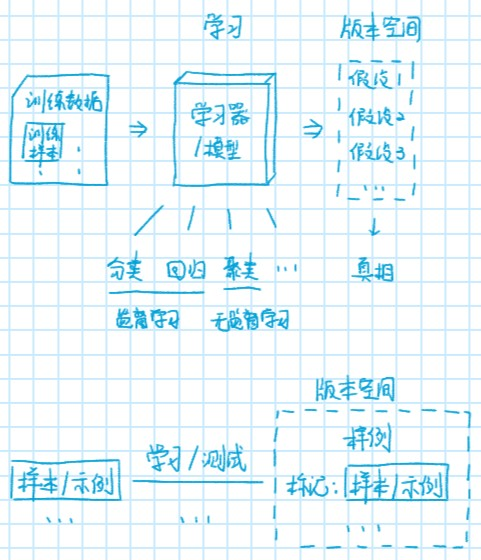
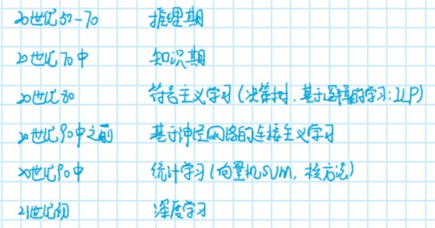
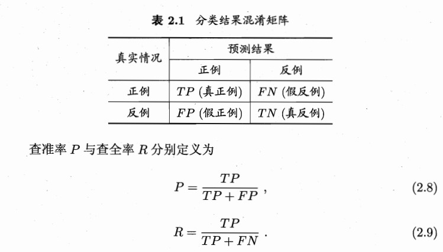
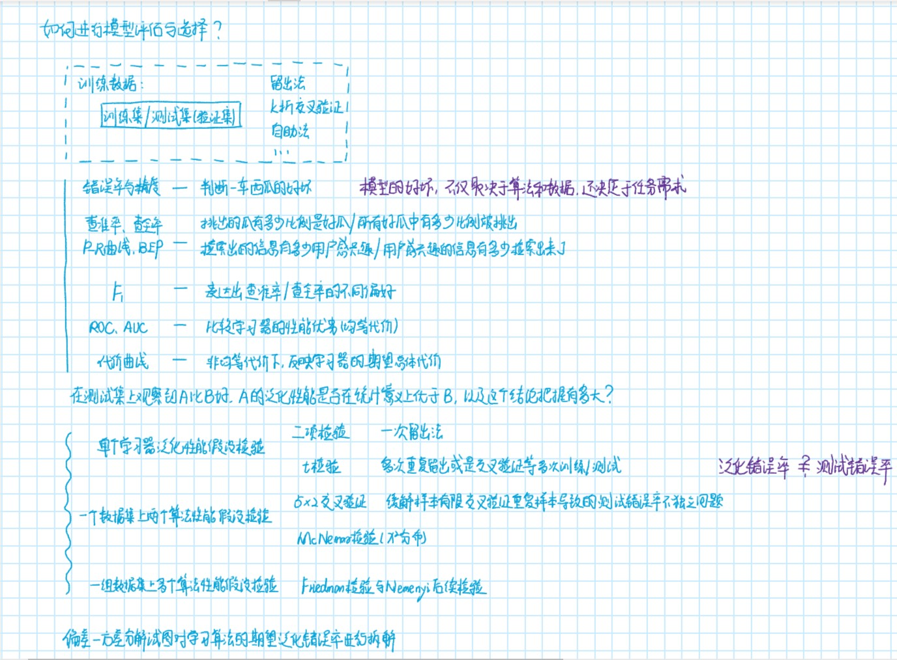

# 周志华 西瓜书 学习笔记

<https://github.com/Vay-keen/Machine-learning-learning-notes.git>

## 绪论

1. 引言
   - 人工智能、机器学习、深度学习的关系？
   - 什么是机器学习？
   - 机器学习的基本步骤？
   - 机器学习的几种常见算法？
2. 基本术语
    - 数据集(data set)、示例/样本(instance/sample)、属性/特征(attribute/feature)、属性值(attribute value)、属性空间/样本空间(attribute/feature space)、特征向量(feature vector)、维数(dimensionality)
    - 学习/训练(learning/training)、训练数据(training data)、训练样本(training sample)、训练集(training data)、测试数据(testing data)、测试样本(testing sample)、测试集(testing data)、假设(hypoyhesis)、真相/真实(ground-truth)、标记(label)、样例(example)、标记空间/输出空间(label space)
    
    - 分类(classification)、回归(regression)、二分类(binary classification)、正类/反类(positive/negative class)、多分类(multi-class classification)、聚类(clustering)、监督学习/无监督学习(superised/unsuperised learning)、泛化能力(generalization)、分布(distribution)、独立同分布(i.i.d independent and identically distributed)
    - 版本空间(version space)、归纳偏好(inductive bias)、奥卡姆剃刀原理(Occam's razor)、没有免费午餐定理(NFT No Free Launch Theorem)
    - 奥卡姆剃刀原理：若有多个假设与观察一致，则选择最简单那个
    - 没有免费午餐定理：没有一个学习算法可以在任何领域总是产生最准确的学习器。寓意是要谈论算法的相对优劣，必须要针对具体的学习问题；在某些问题上表现好的学习算法，在另一些问题上却可能不尽人意。
3. 发展历程
   

## 模型评估与选择

1. 误差与过拟合
   - 错误率(error rate)、精度(accuracy)、误差(error)、训练/经验误差(training/empirical error)、泛化误差(generalization)、过拟合(overfitting)、欠拟合(underfitting)
2. 评估方法
   - 测试误差(testing error)、留出法(hand-out)、k折交叉验证(k fold cross validation)、留一法(Leave-One-Out LOO)、自助法(bootstrapping)、调参(parameter tuning)、验证集(validation set)
3. 性能度量
   - 均方误差(mean squared measure)、查准率(precision)、查全率(recall)、F1度量
   - 混淆矩阵(confusion matrix)、P-R曲线(precision-recall curve)、平衡点(Break-Event Point BEP)、F1度量、宏查准率/宏查全率/宏F1(macro-P/macro-R/macro-F1)、微查准率/微查全率/微F1(micro-P/micro-R/micro-F1)
   - 二分类问题分类结果的混淆矩阵：  
   真正例/假正例/真反例/假反例(true positive TP /false positive FP/true negetive TN/false negetive FN)  
    
   - 受试者工作特征(Receiver Operating Characteristic ROC)、ROC曲线下面积(Area Under ROC curve AUC)
   - 非均等代价(unequal cost)、代价矩阵(cost matrix)、总体代价(total cost)、代价敏感错误率(cost-sensitive error rate)、代价曲线(cost curve)、规范化/归一化(normalization)
4. 比较检验
   - 假设检验(hypothesis test)、泛化错误率(generalization error rate)、测试错误率(test error rate)、二项检验(binimial test)、t-检验(t-test)、成对t-检验(paired t-tests)、McNemar检验、Friedman检验、Nemenyi后续检验  
   `概率论与数理统计：假设检验，拒绝域、显著性水平、第一类错误（弃真错误）、第二类错误（纳伪错误）`
5. 偏差与方差
   - 偏差-方差分解(bias-variance decompodition)、偏差-方差窘境(bias-variance dilemma)
   

## 线性模型

1. 线性回归
   - 线性回归(linear regression)、多元线性回归(multivariate linear regression)、正则化(regularization)、对数线性回归(log-linear regression)、广义线性模型(generalized linear model)、联系函数(link function)
2. 对数几率回归
   - 单位阶跃函数(unit-step function)、对数几率函数(logistic function)、Sigmoid函数
   `概率论与数理统计+应用统计学：最小二乘法(least square method)、参数估计(parameter estimation)、极大似然估计(maximum likeihood method)`
   `线性代数+矩阵论：满秩矩阵(full-rank matrix)、正定矩阵(positive definite matrix)`
   `数值优化、凸优化、最优化理论：梯度下降法(gradient descent method)、牛顿法(Newton method)`
3. 线性判别分析
   - 线性判别分析(linear discriminant analysis LDA)、类内散度矩阵(within-class scatter matrix)、类间散度矩阵(between-class scatter matrix)、广义瑞利商(generalized Rayleigh quotient)
4. 多分类学习
   - 拆分策略：“一对一”(One vs. One OvO)、“一对其余”(One vs. Rest OvR)、“多对多”(Many vs. Many MvM)、“纠错输出码”(error correcting outputs codes ECOC)
5. 类别不平衡问题
   - 类别不平衡(class-imbalance)、“再缩放”：“欠采样”(undersampling)、“过采样”(oversampling)、“阈值移动”(threshold-moving)

## 决策树
