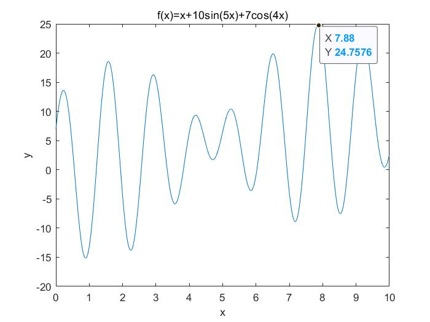
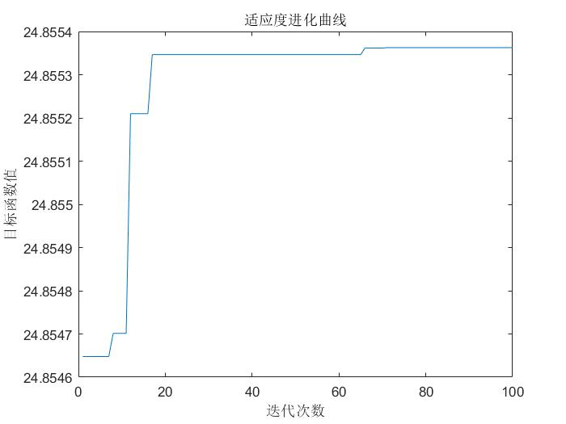

## 遗传算法(Genetic Algorithm, GA)
#### 定义
遗传算法是模拟`达尔文生物进化论的自然选择`和`遗传学机理`的生物进化过程的计算模型，是一种`通过模拟自然进化过程搜索最优解`的方法。
#### 概念
| 遗传学术语 | 遗传算法术语 |
| :--- | :--- |
| 群体(population) | 可行解集 |
| 个体(individual) | 可行解 |
| 基因型(genotype) | 位串 |
| 表现型(phenotype) | 位串解码后的参数 |
| 染色体(chromosome) | 可行解的编码 |
| 基因(gene) | 可行解编码的分量 |
| 适应度(fitness) | 评价函数值 |
| 选择(selection) | 选择操作 |
| 交叉(crossover) | 交叉操作 |
| 变异(mutation) | 变异操作 |
#### 流程
1. 初始化。
   - 设置 进化代数计数器 g = 0
   - 设置 最大进化代数 G 
   - 随机生成 M 个个体作为初始群体 P(0)
2. 个体评价。
   - 计算群体 P(0)中各个个体的适应度
3. 选择运算。
   - 作用于群体，结合适应度，按照一定的规则和方法，选择优良个体遗传到下一代群体
4. 交叉运算。
   - 作用于群体，选中成对个体，以某一概率交换它们之间的部分染色体，产生新的个体
5. 变异运算。
   - 作用于群体，选中的个体，以某一概率改变某一个或一些基因为它的等位基因
6. 终止条件判断。
   - 群体 P(t) 进过选择、交叉和变异运算之后得到下一代群体 P(t+1)，计算其适应度值，并根据适应度值进行排序，准备下一次遗传操作
   - 若 g <= G，则 g = g + 1，跳转到步骤 2
   - 若 g > G，则进化过程中所得到的具有最大适应度的个体作为最优解输出，终止计算
#### 轮盘赌（Roulette Wheel Selection）
轮盘赌选择法中，各个个体的选择概率和其适应度值成比例，适应度越大，选中概率也越大。实际在进行轮盘赌选择时个体的选择往往不是依据个体的选择概率，而是根据`累积概率`来进行选择。
1. 计算每个个体的被选中概率 p(x)
2. 计算每个部分的累积概率 q(x)
3. 随机生成一个数组 m，数组中的元素取值范围在0和1之间，并将其按从小到大的方式进行排序。若累积概率 q(x) 大于数组中的元素 m[i] ，则个体 x(i) 被选中，若小于 m[i]，则比较下一个个体 x(i+1) 直至选出一个个体为止。
4. 若需要转中 N 个个体，则将步骤 3 重复 N 次即可
#### 案例一   无约束目标函数
用遗传算法求函数f(x)=x+10sin(5x)+7cos(4x)的最大值，其中x的取值在[0,10]。这是一个有多个局部极值的函数，使用MATLAB绘制图像如下。
```MATLAB
close all;
clear;
clc;
x = 0:0.01:10;
y = x+10*sin(5*x)+7*cos(4*x);
plot(x,y);
xlabel('x');
ylabel('y');
title('f(x)=x+10sin(5x)+7cos(4x)');
```

 


```MATLAB
clear;  % 清除所有变量
clc;  % 清屏
NP = 50; % 种群数量
L= 20; % 二进制位串长度
Pc = 0.8; % 交叉率
Pm = 0.1; % 变异率
G= 100; % 最大遗传代数
Xs = 10; % 上限
Xx = 0; % 下限
f = round(rand(NP,L)); %随机获得初始种群

% 遗传算法循环
for k= 1:G
    % 二进制解码过程
    for i = 1:NP
        U = f(i,:); % 种群一列对应一个个体
        m = 0; 
        for j = 1:L
            m = U(j)*2^(j-1) + m;
        end
        x(i) = Xx+m* (Xs-Xx)/(2^L-1);  % (Xs-Xx)/(2^L-1) 是编码精度
        Fit(i) = func1(x(i));
    end

    maxFit = max (Fit); % 适应度最大值
    minFit = min (Fit); % 适应度最小值
    rr = find (Fit==maxFit); % 种群最优个体下标
    fBest = f(rr(1,1),:); % 历代最优个体二进制形式
    xBest = x(rr(1,1));  % 历代最优个体 % rr(1,1) 取当多个最值时只取其中第一个数
    Fit =(Fit-minFit)/(maxFit-minFit); %归一化适应度值

    % 基于轮盘赌的复制操作
    sum_Fit= sum(Fit);
    fitvalue= Fit./sum_Fit; % 可以用深度学习中的softmax函数替换这里
    fitvalue = cumsum (fitvalue); % cumsum 计算累计和 比如 1,2,3 变成 1,,3,6
    ms = sort(rand(NP,1)); % 生成一个从小到大的随机序列
    fiti = 1;
    newi = 1;
    while newi <= NP
        if ms(newi) < fitvalue(fiti)
            nf(newi,:) = f(fiti,:);
            newi = newi+1;
        else
            fiti =fiti+1;
        end
    end

    % 基于概率的交叉操作 
    for i = 1:2:NP % 步长为2，是将相邻的两个个体进行交叉
        p = rand;
        if p< Pc % 概率低于交叉概率 对这个两个个体进行交叉
            q = round(rand(1,L)); % 生成一个随机 0-1 序列
            for j = 1:L 
                if q(j) == 1 % 序列为 1 时在对应位置基因进行交叉
                    temp = nf(i+1,j);
                    nf(i+1,j) = nf(i,j);
                    nf(i,j) = temp;
                end
            end
        end
    end

    % 基于概率的变异操作 
    i = 1;
    while i <= round(NP* Pm)
        %随机选取一个需要变异的染色体
        h = randi ([1,NP],1,1); % randi 生成一个 1*1 且值在 1-NP 范围内的整数 
        for j = 1 : round (L*Pm)
            %随机选取需要变异的基因数
            g = randi ([1,L],1,1);
            nf(h, g) =~ nf(h, g);
        end
        i= i+1;
    end
    f = nf;
    f(1,:) = fBest; % 保留最优个体在新种群中
    trace(k) = maxFit;  %历代最优适应度
end
xBest; %最优个体
figure;
plot(trace);
xlabel('迭代次数');
ylabel('目标函数值');
title('适应度进化曲线');
%% 适应度函数
function result = func1(x)
fit = x+10*sin (5*x)+7*cos ( 4*x);
result = fit;
end
```

 

#### 思考
- [ ] 初始化参数的选择(种群方式、种群个数、种群迭代次数)？
- [ ] 适应度函数评价体系的制定？
- [ ] 编码方式的选择(二进制编码、实值编码等)？
- [ ] 选择的方式(轮盘赌等)？
- [ ] 交叉和变异的方式(基于概率的交叉变异等)？
- [ ] 遗传算法的变体(与其他优化算法结合？)
- [x] MATLAB遗传算法工具箱的使用？
    - MATLAB 2021已经移除优化工具箱，
    - 官方推荐使用实时脚本.mlx文件(类似juypter用法)编写优化问题
- [ ] 遗传算法的其他实现(Python)？

- [x] 本文更新在 2022-8-15 15:48