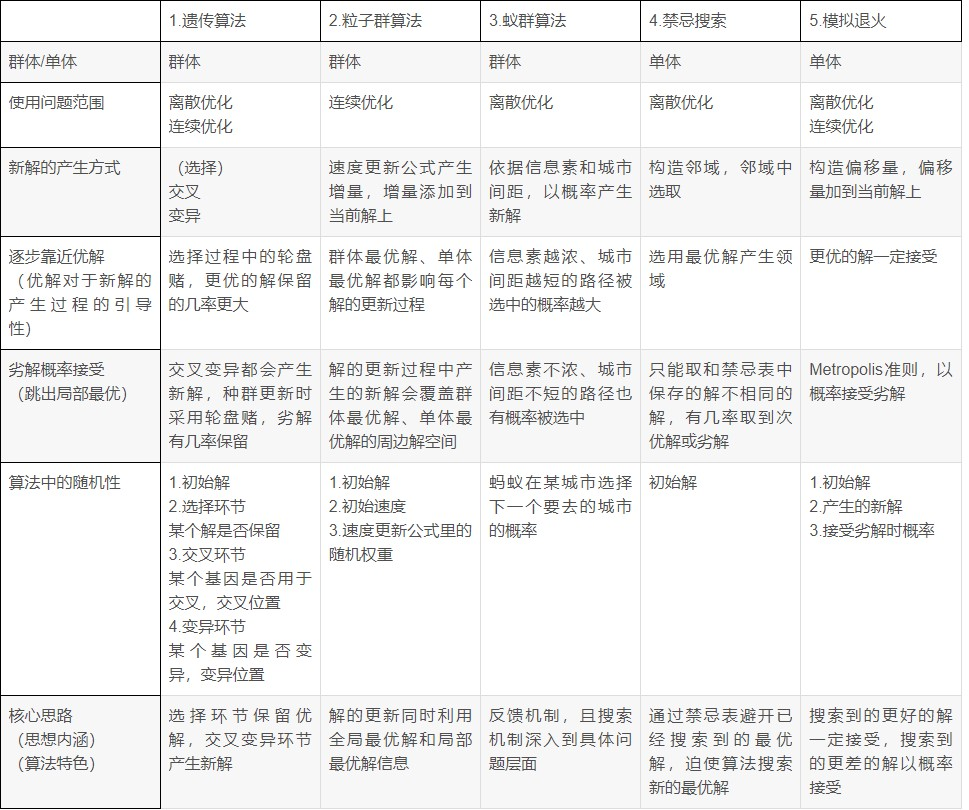

# 启发式算法

参考书籍 ：《智能优化算法与MATLAB实例》

启发式算法可以这样定义：一个`基于直观或经验构造`的算法，在`可接受的花费（指计算时间和空间）下`给出待解决组合优化问题每一个实例的`一个可行解`，该可行解与最优解的偏离程度一般不能被预计。现阶段，启发式算法以仿自然体算法为主，主要有蚁群算法、模拟退火法、神经网络等。

## 思考

- [ ] 有限差分算法、免疫算法？
- [x] 本文更新在 2022-8-21 18:30
