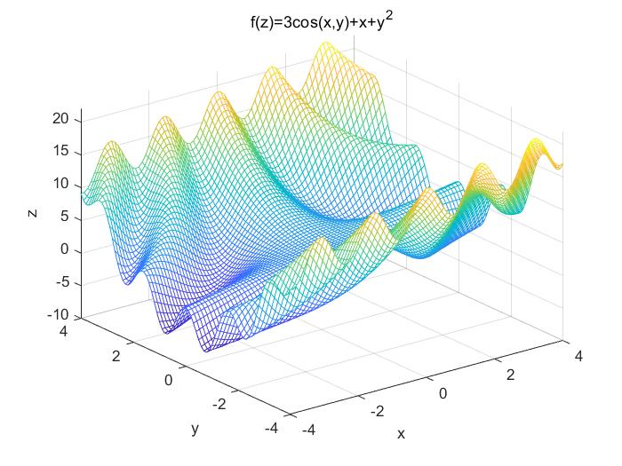
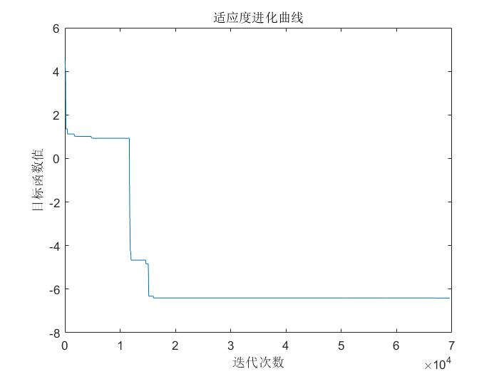

## 退火算法 (Simulated Annealing, SA)
#### 定义
退化算法是基于`Monte-Carlo 迭代求解策略`的一种`随机寻优算法`，其出发点是基于`物理中固体物质的退火过程`与`一般组合优化问题`之间的相似性。
#### 原理
#### 流程
1. 初始化
   - 设置 初始温度、衰减系数 T0 K 
   - 设置 初始解状态 X0
   - 设置 马尔科夫链长度 L
2. 沿`马尔科夫链`重复步骤 3 和步骤 4
3. 产生新解 X'
4. 计算适应度增量 E(X') - E(X)
   - 若增量 > 0，接受 X'作为新的当前解
   - 若增量 < 0，以`Metropolis法`概率接受该解
5. 判断是否满足终止条件
   - 若满足终止条件，输出当前解为最优解
   - 若不满足终止条件，降低温度，且 T 趋向于 0，跳转步骤 2
#### 案例一 
求函数 f(x,y)=3cos(xy)+x+y^2的最小值，其中x的取值范围为[-4,4]，y的取值范围是[-4,4]，这是一个有多个局部极值的函数。
```MATLAB
% 模拟退火算法解决函数极值 
clear;                          %清除所有变量
close all;                      %清图
clc;                            %清屏
[x,y] = meshgrid(-4:0.1:4,-4:0.1:4);
f = @(x,y)3*cos(x.*y)+x+y.^2;
z = f(x,y);
mesh(x,y,z);
xlabel('x');
ylabel('y');
zlabel('z');
title('f(z)=3cos(x,y)+x+y^2');
```
 

```MATLAB
% 初始化 
clear;                          %清除所有变量
clc;                            %清屏
XMAX= 4;                        %搜索变量x最大值
XMIN= -4;                       %搜索变量x最小值
YMAX= 4;                        %搜索变量y最大值
YMIN= -4;                       %搜索变量y最小值
% 冷却表参数 
L = 100;                        %马可夫链长度
K = 0.99;                       %衰减参数
S = 0.02;                       %步长因子
T = 100;                          %初始温度
YZ = 1e-8;                      %容差
P = 0;                          %Metropolis过程中总接受点
% 随机选点 初值设定 
PreX =  rand * (XMAX-XMIN)+XMIN;
PreY =  rand * (YMAX-YMIN)+YMIN; 
PreBestX = PreX;
PreBestY = PreY;
% 当预测值和最优值差值大于一定值才能启动程序
PreX =  rand * (XMAX-XMIN)+XMIN;
PreY =  rand * (YMAX-YMIN)+YMIN; 
BestX = PreX;
BestY = PreY;
% 每迭代一次退火一次(降温), 直到满足迭代条件为止 
trace = [];
deta = abs(func( BestX,BestY)-func (PreBestX, PreBestY));
while (deta > YZ) && (T > 0.001)
    T=K*T; 
    % 在当前温度T下迭代次数 
    for i=1:L  
        % 在此点附近随机选下一点 
        p=0;
        while p==0
            NextX = PreX + S * (rand * (XMAX-XMIN) + XMIN);
            NextY = PreY + S * (rand * (YMAX-YMIN) + YMIN);
            if (NextX >= XMIN && NextX <= XMAX && NextY >=...
                    YMIN && NextY <= YMAX)
                p=1;
            end
        end
        % 是否全局最优解 
        if (func(BestX,BestY) > func(NextX,NextY))
            % 保留上一个最优解 
            PreBestX = BestX;
            PreBestY = BestY;
            % 此为新的最优解 
            BestX=NextX;
            BestY=NextY;
        end
        % Metropolis过程 
        if (func(NextX,NextY) - func(PreX,PreY) < 0)
            % 接受新解 
            PreX = NextX;
            PreY = NextY;
            P = P + 1;
        else
            p1 = exp(-1 * (func(NextX,NextY) - func(PreX,PreY)) / T);
            % 接受较差的解 
            if p1 > rand        
                PreX = NextX;
                PreY = NextY;
                P = P + 1;         
            end
        end
        trace(P) = func(BestX, BestY);
    end
    deta = abs(func( BestX,BestY)-func (PreBestX, PreBestY));
end
fprintf('最小值在点:%f,%f\n',BestX,BestY);
fprintf( '最小值为:%f,\n',func(BestX, BestY));
figure;
plot(trace(2:end));
xlabel('迭代次数');
ylabel('目标函数值');
title('适应度进化曲线');

% 适应度函数 
function value=func(x,y)
value=3*cos(x*y)+x+y*y;
end
```


#### 思考
- [ ] 初始化参数的选择(初始温度和衰减系数、初始解选取、马尔可夫链长度)？
- [ ] Metropolis准则的变体？
- [ ] 适应度函数的制定？
- [ ] 终止条件的确定？
- [ ] 退火算法的改进(增加记忆功能，增加升温过程，改变产生新解机制等)？
- [ ] 粒子群算法的不同写法(Python)？
- [x] 本文更新在 2022-8-21 15:30

