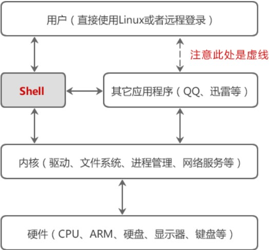
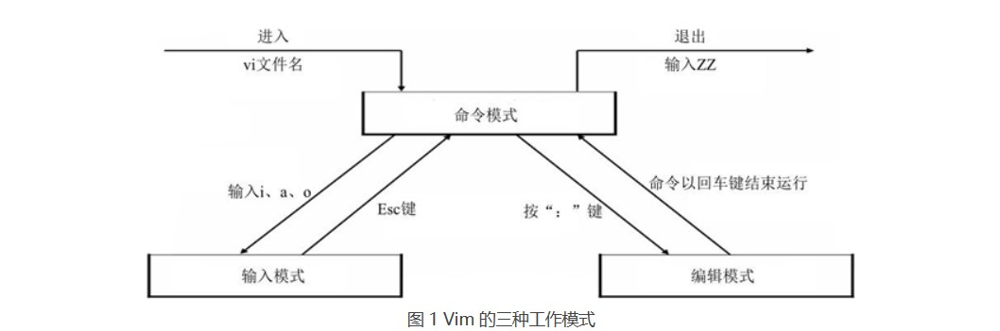
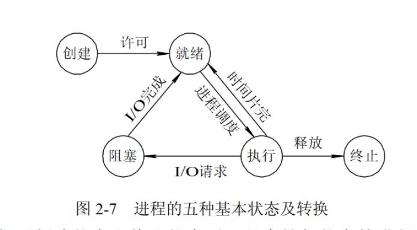
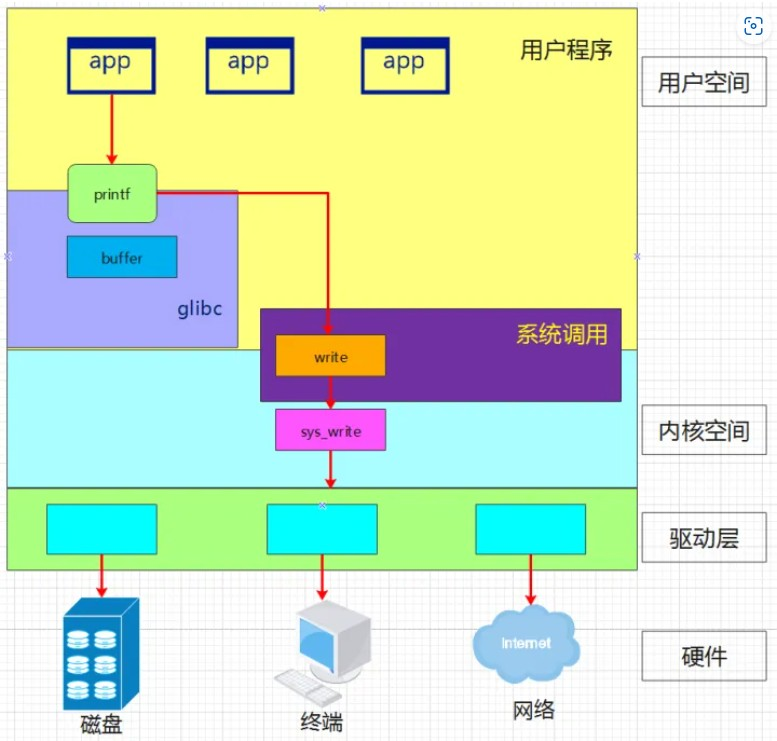
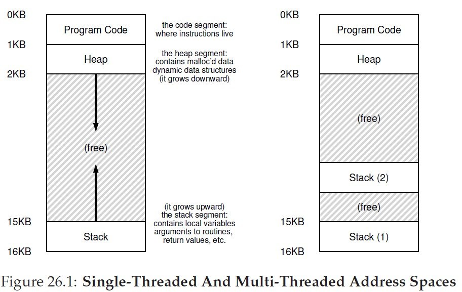
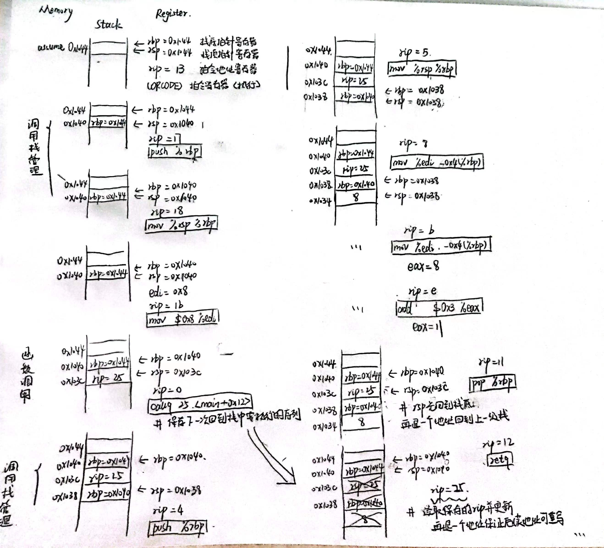

# 操作系统基础

## 目录

[WSL, Terminal, VScode](#wsl-terminal-vscode)  
[Unix, Linux, POSIX, LSB](#unix-linux-posix-lsb)  
[熟悉工具](#熟悉工具)
[PartII Concurrency](#partii-concurrency)
[PartI Virtualization](#parti-virtualization)
[总结](#总结)

## WSL, Terminal, VScode

在Microsoft store中安装Windows terminal，它是适用于命令提示符，Powershell，wsl等的终端应用程序。这样就可以实现在Windows下编辑代码，在Linux下编译运行的效果；链接到 VScode 后新建终端和外部终端（保持打开）作用一样。

<https://www.bilibili.com/video/BV1aA411s7PJ/>  
wsl 安装成功视频 —— b站
<https://learn.microsoft.com/en-us/windows/wsl/>  
wsl 官方安装文档 —— 官网

## Unix, Linux, POSIX, LSB

UNIX 操作系统由肯•汤普森（Ken Thompson）和丹尼斯•里奇（Dennis Ritchie）发明。后来由芬兰人林纳斯·托瓦兹（Linus Torvalds）写了新的操作系统 Linux，它与 Unix 在外观和交互上类似，故也称是类 Unix 系统。Linux 开源后与缺少内核的 GNU 打包发布，故也称 GNU/Linux，后来大家省略 GNU 叫的 Linux 其实是类 Uinx 的内核和大量 GNU 开源软件的一个集合体。Linux 发行版说简单点就是将 Linux 内核与应用软件进行一个打包，目前市面上知名的发行版有 Ubantu、CentOS 等等。

Unix 1969 年诞生于 AT&T 贝尔实验室，并在 1973 年使用 C 语言进行了重写，从此就具有了很好的可移植性。但是当 AT&T 在 1984 年由于分拆而得以进入计算机领域的市场之后，却引发了 Unix 业界的一场大战。当时最为主要的两个版本是 AT&T 的 System V 和伯克利的 BSD。二者在技术方面（例如终端）和文化方面都存在很多分歧，导致应用程序很难在不同的系统上平滑地进行移植，为了解决这个问题，IEEE（Institute of Electrical and Electronic Engineers）的 1003 委员会着手开发了一系列标准，这就是后来的 POSIX（Portable Operating System Interface for UNIX）标准。其目的是为那些兼容各种 UNIX 变种的应用程序制定应用程序编程接口（API）规范，从而确保这些应用程序的兼容性。这些标准后来被 ISO/IEC 采纳，成为 ISO/IEC/IEEE 9945:2009 标准。LSB 是 Linux 标准化领域中实际上的标准。

ISO，国际标准化组织的英语简称，全称是International Organization for Standardization。IEC，是国际电工委员会International Electro Technical Commission的缩写，它是非政府性国际组织。IEEE，Institute of Electrical and Electronics Engineers美国电气和电子工程师协会，是一个国际性的电子技术与信息科学工程师的协会。

<http://c.biancheng.net/view/707.html>  
Linux和Unix的关系及区别——C语言中文网
<https://blog.csdn.net/Rong_Toa/article/details/109065264>
Linux标准化历史——CSDN

## 熟悉工具

### apt/apt-get

apt（Advanced Packaging Tool）是一个在 Debian 和 Ubuntu 中的 Shell 前端软件包管理器。

``` shell
    sudo apt install bulid-essential    安装 bulid-essential 
    sudo apt install git                安装 git
    sudo apt install fish               安装 fish
    sudo apt install nodejs             安装 Node.js（JavaScript的运行环境）
    sudo apt install npm                安装 npm（Node.js官方提供的包管理工具）
    npm install -g tldr                 安装 tldr  
    echo $SHELL                         查看当前使用的shell
    echo $0                             查看当前使用的shell
    fish/exit                           进入fish/退出fish
```

### gcc/g++

Linux 下使用最广泛的 C/C++ 编译器是 gcc/g++，大多数的 Linux 发行版本都默认安装。默认的 Ubuntu 软件源仓库中包含了一个软件包组，名称为 `build-essential`，它包含了 GNU 编辑器集合，GNU 调试器，和其他编译软件所必需的开发库和工具。很多开源项目包括 Linux kernel 和 GNU 工具，都是使用 gcc 进行编译的。GNU 编译器集合是一系列用于语言开发的编译器和库的集合，包括: C, C++, Objective-C, Fortran, Ada, Go, and D等编程语言。

> 这样就掌握了在Linux下结合VScode编辑编译链接C/C++代码的技能；Linux内核大部分是用C语言编写的，还有部分是用汇编语言写的，因为在对于硬件上，汇编有更好的性能和速度。Linux一个文件是否能被执行，和后缀名没有太大的关系，主要看文件的属性有关

### tldr

tldr = Too Long; Didn't Read，它简化了烦琐的man指令帮助文档，仅列出常用的该指令的使用方法。相比较man给出完整的帮助文档而言，大多数情况下，给出几个指令的使用demo可能正是我们想要的。

### Git

Git 软件包被包含在 Ubuntu 默认的软件源仓库中，并且可以使用 apt 包管理工具安装。

### make

make 在 Linux（unix ）环境下使用GNU的make工具能够比较容易的构建一个属于你自己的工程，整个工程的编译只需要一个命令就可以完成编译、连接以至于最后的执行。不过这需要我们投入一些时间去完成一个或者多个称之为Makefile 文件的编写。

### Shell

Shell 是一个应用程序，它连接了用户和 Linux 内核，让用户能够更加高效、安全、低成本地使用 Linux 内核，这就是 Shell 的本质。bash（Bourne Again Shell），由GNU开发的Shell，是各种Linux发行版标准配置的Shell。Fish（Friendly Interactive Shell）最大特点就是方便易用，很多其他 Shell 需要配置才有的功能，Fish 默认提供，不需要任何配置。Shell中输入的命令，有内置命令(cd,pwd等写在shell程序中)，也有其他应用程序命令，叫外部命令（ls等动态链接的共享文件）。Shell 中的命令和 Python 都是解释性语言。



### Tmux

Tmux是一个终端复用器（terminal multiplexer），非常有用，属于常用的开发工具。命令行的典型使用方式是，打开一个终端窗口（terminal window，以下简称"窗口"），在里面输入命令。用户与计算机的这种临时的交互，称为一次"会话"（session） 。会话的一个重要特点是，窗口与其中启动的进程是连在一起的。打开窗口，会话开始；关闭窗口，会话结束，会话内部的进程也会随之终止，不管有没有运行完。Tmux 就是会话与窗口的"解绑"工具，将它们彻底分离。

### Vim

Vim是一个基于文本界面的编辑工具，使用简单且功能强大。更重要的是，Vim 是所有 Linux 发行版本默认的文本编辑器。Linux Vim有三种工作模式（命令模式、输入模式和编辑模式）。



### 小节

操作系统中常见的应用程序有Core Utilities (coreutils)（命令有cat，ls等）、系统/工具程序（bash, apt, vim, tmux, python等）、其他应用程序（浏览器、播放器等）

## PartII Concurrency

### 进程与线程

**进程**是资源分配的最小单位，**线程**是CPU调度的最小单位。进程间资源不共享，同类线程是共享同一进程分配的资源的。

一个进程崩溃后，在保护模式下不会对其他进程产生影响，但是一个线程崩溃整个进程都死掉。所以多进程要比多线程健壮。每个独立的进程有程序运行的入口、顺序执行序列和程序出口。但是线程不能独立执行，必须依存在应用程序中，由应用程序提供多个线程执行控制，两者均可并发执行。

:memo:Linux中查看进程用ps命令，windows中打开任务管理器

**临界区**指的是一个访问共用资源（例如：共用设备或是共用存储器）的程序片段，而这些共用资源又无法同时被多个线程访问的特性。

每一个进程都有一个**进程号**（PID, Process Identification），进程号是一个正数，用以唯一标识系统中的某个进程。一个进程创建的另一个新进程称为子进程相反地，创建子进程的进程称为父进程。创建进程会不断递增进程号，全部使用完后会循环回一定值重新递增。Linux中PID分别是0,1(init),2的进程会在OS启动之后一直运行直到关机OS结束运行。



### 并发与并行

所谓**并发**，就是通过一种算法将 CPU 资源合理地分配给多个任务，当一个任务执行 I/O 操作时（I/O操作是相当耗时的），CPU 可以转而执行其它的任务，等到 I/O 操作完成以后，或者新的任务遇到 I/O 操作时，CPU 再回到原来的任务继续执行。

并发是针对单核 CPU 提出的，而**并行**则是针对多核 CPU 提出的。多核 CPU 的每个核心都可以独立地执行一个任务，而且多个核心之间不会相互干扰。在不同核心上执行的多个任务，是真正地同时运行，这种状态就叫做并行。

### 库函数和系统调用

系统调用是为了方便使用操作系统的接口，而库函数则是为了人们编程的方便。库函数调用与系统类型无关，不同的系统，调用库函数，库函数会针对系统调用不同的底层函数实现，因此可移植性好。glibc是linux下面c标准库的实现，即GNU C Library。printf函数、glibc库和系统调用在系统中关系图如下：

> GNU C运用于Linux上，ANSI C(C89,C99都有可能)就是标准C库函数。GNU包含ANSI(在一些特性上有扩展)，ANSI可以跨平台(最基本的库大家都有)。ANSI和C++库有交集，也有不同(C++与C的区别)`



### main函数的参数

C 编译器允许main()函数没有参数，或者有两个参数（有些实现允许更多的参数，但这只是对标准的扩展）。这两个参数，一个是int类型，一个是字符串类型。第一个参数是命令行中的字符串数。按照惯例（但不是必须的），这个int参数被称为**argc（argument count）**。第二个参数是一个指向字符串的指针数组。命令行中的每个字符串被存储到内存中，并且分配一个指针指向它。按照惯例，这个指针数组被称为**argv（argument value）**。系统使用空格把各个字符串格开。一般情况下，把程序本身的名字赋值给argv[0]。

### 小节

**KISS原则**是英语 Keep It Simple, Stupid 的首字母缩略字，是一种归纳过的经验原则。KISS 原则是指在设计当中应当注重简约的原则。—— 中文Wiki

**Everything is a file** is an idea that Unix, and its derivatives handle input/output to and from resources such as documents, hard-drives, modems, keyboards, printers and even some inter-process and network communications as simple streams of bytes exposed through the filesystem name space. —— Wiki


## PartI Virtualization

### 内存模型



当程序运行时(进程)，操作系统会在内存上分配一段存储程序运行和产生的数据的区域。地址低位是动态数据结构(`堆 heap`)；地址高位是包含局部变量，函数参数返回值等(`栈 satck`)，递归程序会占用更大的内存空间。全局变量，静态变量和常量等在程序编译时分配固定的内存块，在程序运行时也一直存在。单线程进程只有一个栈，多线程进程有多个栈，栈内变量相互独立，但共享同一个进程中的数据资源。

### 处理器架构，指令集，RISC-V

**处理器架构**，就是CPU的硬件架构，是一堆硬件电路，去实现指令集所规定的操作运算。**指令集**，对于CPU来说，就是介于软件和底层硬件之间的一套程序指令的合集。指令集存储于CPU内部，处理器执行指令会有相应的硬件电路去实现相应操作。

> 所以设计的处理器架构不同，指令集也不同。`

RISC(精简指令集计算机，Reduced Instruction Set Computer-RISC)和CISC(复杂指令集计算机，Complex Instruction Set Computer-CISC)是CPU的两种架构，区别在于不同的CPU设计理念和方法。早期计算机都是CISC架构，有约20%指令会被经常使用在80%的程序中。RISC的想法，主张硬件应该专心加速常用的指令，较为复杂的指令则利用常用的指令去组合。

> 不同的CPU架构导致了机器语言和汇编语言的不同(编译器和处理器也因此不同，它们也是影响程序性能的重要因素)。高级语言编程不考虑底层，也是因为底层语言不同会带来麻烦事

CPU架构是CPU厂商给属于同一系列的CPU产品定的一个规范，主要目的是为了区分不同类型CPU的重要标识。市面上的CPU分类主要分有两大阵营，一个是intel、AMD为首的复杂指令集CPU，另一个是以IBM、ARM为首的精简指令集CPU。两个不同品牌的CPU，其产品的架构也不相同，例如，Intel、AMD的CPU是X86架构的，而IBM公司的CPU是PowerPC架构，ARM公司是ARM架构。

> 目前我们个人电脑CPU基本上都是x86架构(来自Intel和AMD)，指令集内容公开但商用需要版权。`

**RISC-V** 是 2010 年始于伯克利分校的基于 RISC 原则的 **开源** 指令集架构。
> 当然处理器公司会不乐意，开源会导致处理器设计的多样化。`

### 静态链接与动态链接

**静态链接**（Static Linking）是由链接器在链接时将库的内容加入到可执行程序中的做法。链接器是一个独立程序，将一个或多个库或目标文件（先前由编译器或汇编器生成）链接到一块生成可执行程序。这里的库指的是静态链接库，`Windows下以.lib为后缀，Linux下以.a为后缀`。

- 代码装载速度快，执行速度略比动态链接库快；只需保证在开发者的计算机中有正确的.lib文件，在以二进制形式发布程序时不需考虑在用户的计算机上.lib文件是否存在及版本问题。
- 但可执行文件体积大，包含相同的公共代码造成浪费。

**动态链接**（Dynamic Linking），把链接这个过程推迟到了运行时再进行，在可执行文件装载时或运行时，由操作系统的装载程序加载库。这里的库指的是动态链接库，`Windows下以.dll为后缀，Linux下以.so为后缀，是二进制程序文件`。值得一提的是，在Windows下的动态链接也可以用到.lib为后缀的文件，但这里的.lib文件叫做导入库，是由.dll文件生成的。

- 生成的可执行文件较静态链接生成的可执行文件小；适用于大规模的软件开发，使开发过程独立、耦合度小，便于不同开发者和开发组织之间进行开发和测试；不同编程语言编写的程序只要按照函数调用约定就可以调用同一个DLL函数；DLL文件与EXE文件独立，只要输出接口不变（即名称、参数、返回值类型和调用约定不变），更换DLL文件不会对EXE文件造成任何影响，因而极大地提高了可维护性和可扩展性；
- 使用动态链接库的应用程序不是自完备的，它依赖的DLL模块也要存在，如果使用载入时动态链接，程序启动时发现DLL不存在，系统将终止程序并给出错误信息；速度比静态链接慢；

### ELF文件

**ELF** 是一类文件类型，而不是特指某一后缀的文件。ELF(Executable and Linkable Format, 可执行与可链接格式)，在Linux中有三种文件，可执行文件(.out)，可重定位文件(.o)，共享目标文件(.so). `LSB 是 Linux Standard Base`

**可执行文件(Executable File)**，包含代码和数据，是可以直接运行的程序。其代码和数据都有固定的地址，系统可根据这些地址星系把程序加载到内存中执行。`文件的移动本质是文件头文件中信息的改变，而非在存储空间中的移动。`

**可重定位文件(Relocatable File)**，包含基础代码和数据，但它的代码及数据都没有指定绝对地址，因此它适合于其他目标文件链接来创建可执行文件或者共享目标文件。

**共享目标文件(Shared Object File)**，也称动态库文件，包含了代码和数据，这些数据是在链接时被链接器(ld)和运行时动态链接器使用的。

### 汇编语言

 x86汇编一直存在两种不同的语法，在intel的官方文档中使用intel语法，Windows也使用intel语法，而UNIX平台的汇编器一直使用AT&T语法。Intel的格式是 `opcode destination, source`，而AT&T的格式是 `opcode source, destination`。内存分为栈空间（向低位增长）和堆空间（向高位增长），静态区。程序本身是只读的程序数据片段，比如 `int i = 4`，这个4存储于程序本身，在汇编里面又叫立即数(immediate number。

 那么数据的传递就有四种：从内存到寄存器，从寄存器到内存，从立即数到内存，从立即数到内存（数据内存到内存必须经过寄存器）。 `rbp,rsp` 两个寄存器分别是栈底指针和栈顶指针，`rip`是指令序列，每个栈开始和结束的两条语句往往都是函数栈管理的语句；A&T汇编格式中%代表寄存器，$代表立即数，()代表取值。

 环境是x86_64下Linux操作系统gcc编译，C程序 `asm.c` 如下。得到的目标文件 `asm.o` ，用`objdump -d`反汇编函数部分汇编代码如下（A&T格式）。每行信息前半部分是指令的机器码；后半部分是指令汇编码，包括操作码和操作数。

 ``` C
int f(int x)
{
    return x + 3;
}
int main()
{
    return f(8);
}      
 ```

 ``` console

Disassembly of section .text:

0000000000000000 <f>:
   0:   f3 0f 1e fa             endbr64
   4:   55                      push   %rbp
   5:   48 89 e5                mov    %rsp,%rbp
   8:   89 7d fc                mov    %edi,-0x4(%rbp)
   b:   8b 45 fc                mov    -0x4(%rbp),%eax
   e:   83 c0 03                add    $0x3,%eax
  11:   5d                      pop    %rbp
  12:   c3                      retq

0000000000000013 <main>:
  13:   f3 0f 1e fa             endbr64
  17:   55                      push   %rbp
  18:   48 89 e5                mov    %rsp,%rbp
  1b:   bf 08 00 00 00          mov    $0x8,%edi
  20:   e8 00 00 00 00          callq  25 <main+0x12>
  25:   5d                      pop    %rbp
  26:   c3                      retq
 ```



### 硬中断和软中端

软中断是执行中断指令产生的，而硬中断是由外设引发的。硬中断是可屏蔽的，软中断不可屏蔽。

### 环境变量

环境变量（environment variables）一般是指在操作系统中用来指定操作系统运行环境的一些参数，如：临时文件夹位置和系统文件夹位置等。

环境变量可以类比全局变量去尝试理解。当电脑安装的软件愈来愈多，我们不可能记住所有软件的安装路径，运行路径下可执行文件；环境变量PATH中包含所有软件的安装路径，运行软件时会在当前路径和PATH提供的路径下搜索可执行文件，找到后运行它。

环境变量有系统环境变量和用户环境变量之分，系统环境变量对所有用户可用，用户环境变量仅对当前登录用户可用。Linux下的主要的环境变量有`PATH`(可执行文件搜索路径),`PWD`(当前路径),`HOME`(用户目录)等，环境变量是已定义变量，引用时格式为`${variable}`。

---

## 总结

- 想在Linux环境命令行环境下编写程序 `WSL,Terminal,Vscode`
- 想知道 Linux 是什么，为什么要学它  `Unix,Linux,POSIX,LSB`
- 想配置命令行编程环境，学习命令行工具 `gcc,tldr,tmux,vim,make,git,gdb`
- 想知道编写的程序和操作系统是如何联系的，`库函数和系统调用`
- 想学习操作系统的并发 `并发和并行 进程和线程`
- 想知道操作系统上的C程序如何运行 `处理器 内存 汇编`
- OSTEP阅读？QEMU和Make的学习？XV6的使用？

## 2023-1-27 15:40
