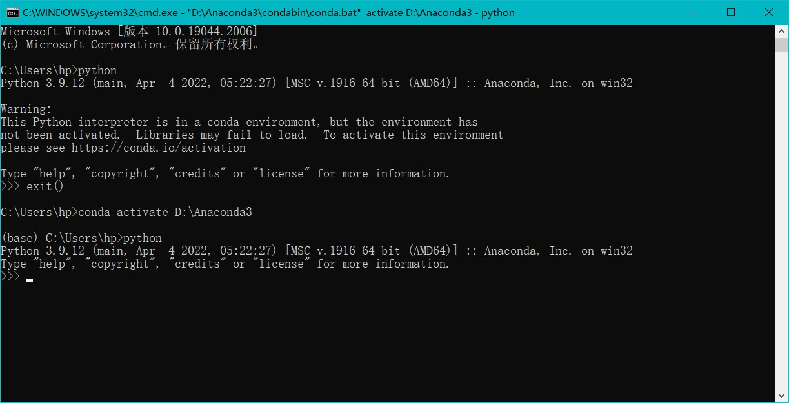

# Anaconda保姆级教程
## Anaconda的环境配置
### Anaconda 
Anaconda 是一个包括python各种包的捆绑软件
先找一个地方下载anaconda，附上清华镜像站链接
https://mirrors.tuna.tsinghua.edu.cn/anaconda/archive/  

### 添加环境变量(加就完事了)
第一个为了Python检查正常；第二个为了conda检查正常；第四个与jupyter notebook 动态库有关
    ```
    <path>.\Anaconda3
    .\Anaconda3\Scripts
    .\Anaconda3\Library\bin
    .\Anaconda3\Library\mingw-w64\bin
    ```


### 检验安装使用是否成功
`win + R` + `cmd`打开命令提示符  
或者打开 Anaconda Prompt

```
有关检验安装的命令如下：  
python 打开 Python 环境
exit() 退出 Python 环境 
ctrl + Z 快捷键退出 Python 环境
conda --version 查看 conda 版本
python -- version 查看 anaconda 中基础 python 版本
conda
conda list
conda info
```
 

### 源配置(使用命令添加源或者直接修改)  

```
有关源配置的命令：
conda config --show 显示 conda 的所有配置信息
conda config --show channels 显示 channels 源配置信息
conda config --show-sources 查看已添加的镜像源
conda config --set show_channel_urls yes 设置在下载包过程中知道包来源
conda config --add channels <urls> 添加指定镜像源
conda config --remove channels <urls> 删除指定镜像源
conda config -- remove-key channels 删除所有镜像源恢复默认
```
(1) 找到.condarc文件（这个文件是 user config file）
输入 `conda info` 可以找到该文件位置(我这里在 C 盘)
(2) 用记事本打开后编辑输入（以下源为清华大学开源软件镜像站）：

```
channels:
  - defaults
show_channel_urls: true
channel_alias: https://mirrors.tuna.tsinghua.edu.cn/anaconda
default_channels:
  - https://mirrors.tuna.tsinghua.edu.cn/anaconda/pkgs/main
  - https://mirrors.tuna.tsinghua.edu.cn/anaconda/pkgs/free
  - https://mirrors.tuna.tsinghua.edu.cn/anaconda/pkgs/r
  - https://mirrors.tuna.tsinghua.edu.cn/anaconda/pkgs/pro
  - https://mirrors.tuna.tsinghua.edu.cn/anaconda/pkgs/msys2
custom_channels:
  conda-forge: https://mirrors.tuna.tsinghua.edu.cn/anaconda/cloud
  msys2: https://mirrors.tuna.tsinghua.edu.cn/anaconda/cloud
  bioconda: https://mirrors.tuna.tsinghua.edu.cn/anaconda/cloud
  menpo: https://mirrors.tuna.tsinghua.edu.cn/anaconda/cloud
  pytorch: https://mirrors.tuna.tsinghua.edu.cn/anaconda/cloud
  simpleitk: https://mirrors.tuna.tsinghua.edu.cn/anaconda/cloud
```

### 修改 jupyter 工作路径
1. 打开Anaconda Prompt，输入命令找到jupyter配置文件位置
  `jupyter notebook --generate-config`
2. 在电脑上找到该文件后用记事本打开修改下面路径
  `## The directory to use for notebooks and kernels.`
  `c.NotebookApp.notebook_dir = 'X:\XXX...`
3. 然后打开 jupyter 快捷方式的属性
  删掉目标中的 %USERPROFILE% 并在后面添加上刚才设置好的默认工作路径
   

### 修改虚拟环境保存路径
```
有关虚拟环境设置的命令：
`conda config --add <key> <value>` 修改增加配置
`conda config --remove <key> <value>` 修改删除配置
`conda config --add envs_dirs <./Anaconda3:/envs>` 增加虚拟环境默认安装路径
`conda config --remove envs_dirs <./Anaconda3:/envs>` 删除虚拟环境默认安装路径
```
如果环境仍然安装到C盘，可能是envs文件夹被设置为只读，此时勾掉只读，User权限全部设置为允许
 

### 创建并管理虚拟环境
```
conda env list 查看当前存在的虚拟环境
conda info -e 查看当前存在的虚拟环境
conda create -n <envname> python=X.X 创建虚拟环境
activate <envname> 激活指定虚拟环境
conda remove -n <envname> --all 删除虚拟环境
```

### 把虚拟环境作为核添加到juypter中
如果在 anaconda navigator 中为新环境装jupyter，会给开始菜单新增加一个jupyter 快捷方式

```
`jupyter kernelspec list` 查看juypter所有核
`juypter kernelspec remove <kernelname>` 卸载jupyter内核 
`python -m ipykernel install --user` 重装系统核
```
1. `conda install ipykernel` `conda install -n <envname> ipykernel` 在 jupyter 环境中增加切换核功能的依赖包
2. `python -m ipykernel install --user --name <envname> --display-name "<displayname>"` 在juypter中装环境核

### juypter好用的配置（安装上就完事了）
`pip install jupyter_contrib_nbextensions` jupyter扩展程序
`pip install jupyter_nbextensions_configurator` jupyter 扩展程序
Hinterland 代码自动补全
Execute Time 显示执行时间
Table of Comtents 目录索引
spellchecker 拼写检查
Togg all line numbers 代码行号

## anaconda的几大优点
1. 包含 Conda
Conda是一个辅助进行包管理和环境管理的工具。目前是Ananconda默认的Python包和环境管理工具，所以安装了Ananconda完整版，就默认安装了Conda。Conda既具有pip的包管理能力。这里需要对 conda install xxx 命令和 pip install xxx 进行区别。

   - **conda install xxx**
   这种方式安装的库都会放在 `anaconda3/pkgs` 目录下，这样的好处就是，当某个环境下已经下载好了某个库，再在另一个环境中还需要这个库时，就可以直接从 pkgs 目录下将该库复制到新环境而不用重复下载。对于jupyter中的不同环境来说，只要曾经用 conda 安装过，不同环境就可以免安装直接使用。conda 所能下载的包数量要远小于PypI，它的大部分包是 python 写的，但也支持了不少非 python 语言写的依赖项。包之间有严格的依赖检查，是一个超越 python 的环境管理器，能够创建多个环境，环境之间相互隔离。

   - **pip install xxx**
   分两种情况，一种情况是当前 conda 环境中的 python 是 conda 安装的，和系统的不一样，那么 xxx 会被安装到`anaconda3/envs/current_env/Lib/site-packages` 文件夹中，如果当前 conda 用的是系统的 python，那么 xxx 会通常被安装到系统 python 文件夹中。PyPI是Python编程语言的软件存储库，全称为“The Python Package Index”。通过PyPI也可以发现和安装由Python社区开发和共享的软件包。

2. 安装大量工具包
anaconda 会自动安装一个基本的 python ,该 python 的版本与 anaconda 的版本有关。该 python 下已经安装好了一大堆工具包，对于科学计算分析是十分便利的。已经包含在 anaconda 中的包有 numpy(数值运算库) pandas(数据处理库) matplotlib(基础可视化库)，scipy(科学计算库) seaborn(高级可视化库) scikit-learn(流行的机器学习库)。

   - Numpy是最为流行的机器学习和数据科学包，Numpy包支持在多维数据上的数学运算，提供数字支持以及相应高效的处理函数，很多更高级的扩展库（包括Scipy、Matplotlib、Pandas等库都依赖于Numpy库）；
   - Scipy包用于科学计算，提供矩阵支持，以及矩阵相关的数值计算模块，其功能包含有最优化、线性代数、积分、插值、拟合、信号处理和图像处理以及其他科学工程中常用的计算；
   - Pandas用于管理数据集，强大、灵活的数据分析和探索工具，其带有丰富的数据处理函数，支持序列分析功能，支持灵活处理缺失数据等；
   ● Pandas基本的数据结构是Series和DataFrame；
   ● Series就是序列，类似一维数组；
   ● DataFrame相当于一张二维的表格，类似二维数组，它的每一列都是一个Series；
   ● 为了定位Series中的元素，Pandas提供了Index对象，每个Series都会带有一个对应的Index，用来标记不用的元素；
   ● DataFrame相当于多个带有同样Index的Series的组合（本质是Series的容器）；
   - Matplotlib库用于数据可视化，强大的数据可视化工具以及作图库，其主要用于二维绘图，也可以进行简单的三维绘图；
   - Seaborn库是基于Matplotlib的高级可视化库；
   - Sklearn库包含大量机器学习算法的实现，其提供了完善的机器学习工具箱，支持预处理、回归、分类、聚类、降维、预测和模型分析等强大的机器学习库，近乎一半的机器学习和数据科学项目使用该包。

3. 可以创建、使用和管理多个不同的 python 版本管理
   
    `conda install xxx` 使用conda工具安装包
    `conda install -n <envname> xxx` 在指定环境安装包
    `conda uninstall xxx` 使用conda工具卸载包


- [x] 从国内镜像源下载包如果发生下载失败，有可能是网络波动引起，可以重复安装
- [x] 空的虚拟环境里包括python运行解释的基础包，pip和conda的环境管理包等
- [x] 如非必要一般不更新包，因为更新后的包的依赖项包也可能需要更新，导致使用时报错
- [x] 虚拟环境安装路径、安装包路径、镜像源配置文件路径、jupyter工作路径都需要配置
- [x] 基础环境一般不使用，要根据自己具体项目建立自己的环境，否则就失去了环境管理功能的意义！在基础环境的juypter中安装ipykernel包使用新环境的核，不用为新环境再装一个新的jupyter。
- [ ] 本文涉及的命令的官方参考网址后续会列出来
- [x] 2022-9-25 14:00

 

