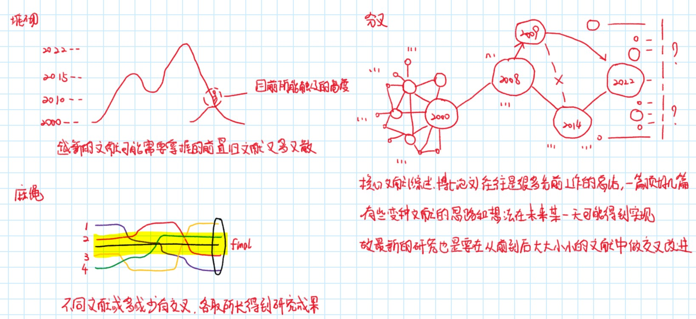
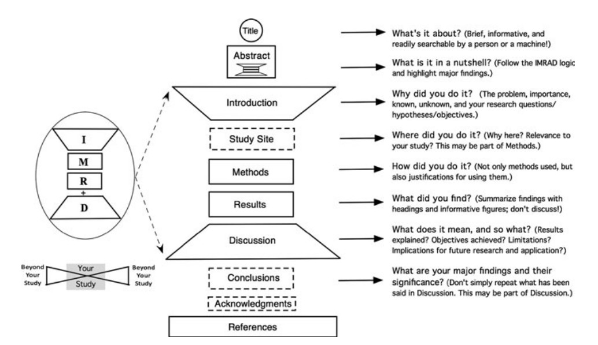

# 提高工作效率的措施
---
## 文献篇

- 搜索文献
    - 如何搜 
        - 按照 不同关键词组合 相关领域大牛所有文章 搜索文献
    - 搜多少
        - 搜索大致 十篇左右 文献后开始阅读
    - 文献价值
        - 国内硕士论文 重复内容多 有效工作少 价值占比小
        - 国内博士论文 新兴内容多 有效工作多 价值占比大
        - 国内期刊文献 有价值的期刊也会发在国外 侧重结果 价值占比中
        - 国外硕博论文 有效工作多 侧重全过程 价值占比大
        - 国外期刊文献 有效工作多 侧重结果 价值占比大

     

- 阅读文献
    - 粗读 
      - 读摘要(abstract)、引言(introduction)、结论(conclusion)等
    - 细读 
      - 读文章主体，方法(methodology)、结论(results)等

     

- 文献笔记
    - 文献上勾画 
        - 笔记工具 Endnote + 数位板
        - 笔记什么 重要观点的划线、引用的参考文献标注、适合画图表示的概念公式等        
    - 总结归纳 
        - 笔记工具 
          - word/markdown + snipaste/onenote + vscode/github
          - 放缩 OneNote 的作用为 头脑风暴 和 笔记配图
          - 放缩 Word和markdown 的作用为 文献笔记
        - 笔记什么
            - 文献选择：选择类似顶刊的重要的文献进行笔记分析 
            - 文献信息：作者、单位、期刊、题目
            - 背景目的及方法：为什么这样做，是怎么做的
            - 结果与讨论：做出什么样的成果
            - 文章好在哪：比较新的点在哪
            - 自我想法：我可以借鉴的点在哪里
            - 文体语言：用自己的话，不要机械照抄

## 学习篇

- 学习流程
  - 参考博客知乎等大佬学习的流程经验分享
  - `视频 + 配套视频 + 别人笔记 + 个人提纲总结 = 快速掌握`
- 学习资料来源
  - 老师同学推荐 书籍 视频 网站
- 学习笔记
  - 优先使用民间大佬的笔记 
    - 写得完整的 可以收藏查阅 
    - 写的有用的 可以提炼归纳   
    - 写的要用的 可以移植更改
    - 写的复杂的 可以编写阅读须知
    - 视频 网站 同电子书籍下笔记

## 程序篇

- 编程语言语法
    - 查询 电子书籍和网站
    - 归纳 常用函数或注意要点
- 代码案例
    - 论文中的代码需要自己复现
    - 书籍中的代码要看配套资源
    - 官网中的代码要看官方文档
    - 博客中的代码要选择性利用
    - 同课题组中的代码要看学校数据库论文
- 代码阅读
    - 拿到代码逐步调试，观测中间变量结果，会更容易理解代码
- 代码改写
    - **先理解代码逻辑，再改写对应功能，最后优化结构效率**！   
- 代码编写
    - 明确不同代码段要实现的功能，明确可以如何实现，再编写！
    - 优化代码时，只有在代码中重复调用的代码块，或者中间变量多且容易混淆的代码块，使用函数进行封装!
    - 函数封装优先在同一文件内封装，只有函数在多个文件中调用时单独封装到一个文件中！

## 项目篇

- 时间安排
    - 要将问题逐步细分完成
    - 同时并行任务不能太多
    - 要预留足时间做出成果
- 归纳总结
    - 收获技巧要总结

# 备注

- [ ] 由于工作效率是抽象概念，总结的经验很难描述清楚，后期可以举示例或者图片等多种形式展现  
- [x] 更新时间 2022-10-22
