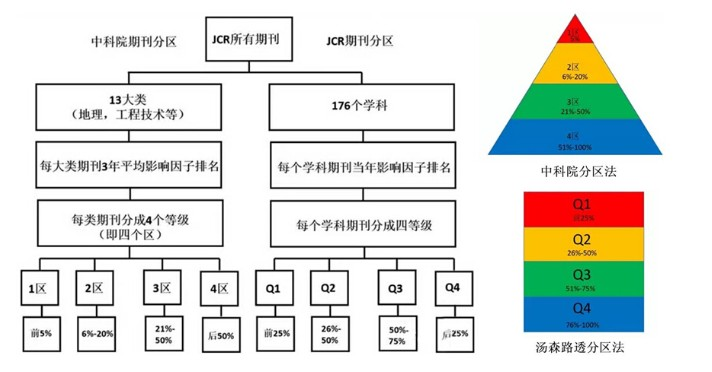
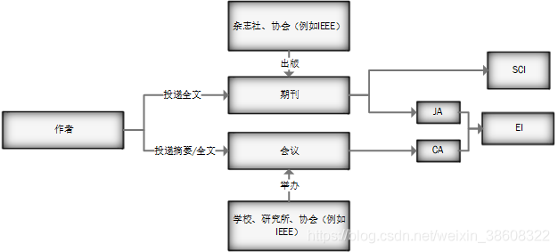

# 搞学术

## 数据库、检索工具

数据库：数据库是按照数据结构来组织、存储和管理数据的仓库。
检索工具：检索工具是用于报道、存储 和 查找 文献线索的工具和设备的总称。  
图书馆目录 、期刊索引、电子计算机检索用的 文献数据库 等等都是检索工具。
它具有报道文献、存储文献、检索文献三大基本功能。  
所以说数据库是检索工具也是正确的。

数据库里可以存放论文、期刊的信息（题目作者摘要参考文献等）  
全文内容那么多字，怎么可能放在收录文章记录的数据库里！  
故 SCI、EI收录全文 的说法就是胡说！！！
最多也就是附上 能够下载到全文的链接。

所以见到一个数据库，声称收录了多少多少文献  
**收录** 代表数据库里有这篇文章的信息  
我们可以使用检索工具检索数据库  
根据自己手头的信息匹配到相关的文章

## SCI、EI

Web of Science 是 ISI 的做的数据库
按照学科和类型分了几个子库，在期刊方面有
理工科叫 SCI（Science Citation Index，科学引文索引）
社会科学的叫 SSCI（Social Sciences Citation Index，社会科学引文索引）
艺术人文的叫 AHCI（Arts & Humanities Citation Index，艺术与人文引文索引）
SCI、EI、ISTP 并称世界三大**科技**文献检索系统

Elsevier（Science Direct）是荷兰一家全球著名的学术期刊出版商。
ScienceDirect 是 Elsevier 旗下著名的学术数据库
Engineering Village 现在也隶属于 Elsevier 旗下。
Engineering Village 是最权威的工程、应用科学领域文献检索平台。
其中的 Compendex 就是 EI（美国工程索引 Engineering Index）数据库
Ei Compendex Web 为 Ei Village 的核心数据库。
EI 文章分为 JA(收录期刊) 和 CA(收录会议) 两种。

`SCI 和 EI 只是工程科技数据库中常用的两个，SCI 目前是包含在 ISI 旗下的 Web of Science 大数据库的子库，EI 是目前 Elsevier 旗下众多数据库的核心，ScienceDirect 也是 Elsevier 旗下著名的数据库，数据库中大量文献被 SCI 收录`

查询链接
Elsevier ScienceDirect 全文数据库 查询网址
<https://www.sciencedirect.com/>
EI Village 工程索引 查询网址
<https://www.engineeringvillage.com>  英文  

参考网站
SCI 百度百科词条
<https://baike.baidu.com/item/%E7%A7%91%E5%AD%A6%E5%BC%95%E6%96%87%E7%B4%A2%E5%BC%95/3990714?fromModule=lemma-qiyi_sense-lemma&fromtitle=SCI&fromid=18829>
EI 百度百科词条
<https://baike.baidu.com/item/%E5%B7%A5%E7%A8%8B%E7%B4%A2%E5%BC%95/7328131>

## JCR分区、中科院分区

EI 是没有自己的影响因子
SCI 引出 JCR（journal citation report 期刊引用报告）  
JCR 可以计算出每种期刊的 IF（Impact Factor 影响因子）  
IF 是期刊前两年发表的论文在该报告年份（JCR year）中被引用总次数除以该期刊在这两年内发表的论文总数  

JCR分区：是把某一个学科的所有期刊上—年的影响因子按降序排列，然后进行等分，分为四个区，每个区所占的比例是相等的，均为25%。
中科院SCi分区：中科院SCI分区是按期刊的三年的平均影响因子来划分的  
一区：前5%；二区：6%-20%；三区：21%-50%；四区：后50%；
科研单位或个人的 SCI 的总收录数量及被引用水平，反映了科研水平。

LetPub 可以查询期刊JCR分区和中科院分区的网址
<http://www.letpub.com.cn/>
中科院分区还可以关注 中国科学院文献情报中心 微型公众号查询

## 出版商、会议组织者、科研工作者、第三方数据库

下图只代表一般情况

