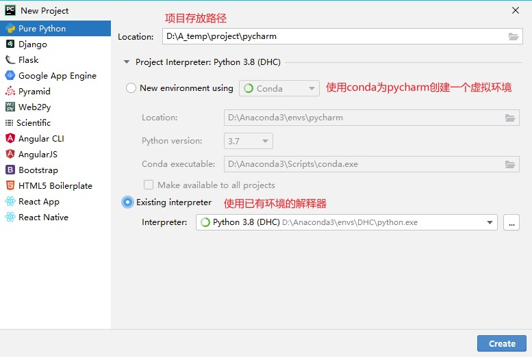

pycharm工程的创建
 
分块执行
shift+alt+E
科学模式下输入#%%
Debug
step over（F8快捷键）
step into（F7快捷键）
step into my code（Alt+Shift+F7快捷键）
step out（Shift+F8快捷键）
Resume program(F9快捷键)
设置好断点，debug运行，然后 F8 单步调试，遇到想进入的函数 F7 进去，想出来在 shift + F8，跳过不想看的地方，直接设置下一个断点，然后 F9 过去。