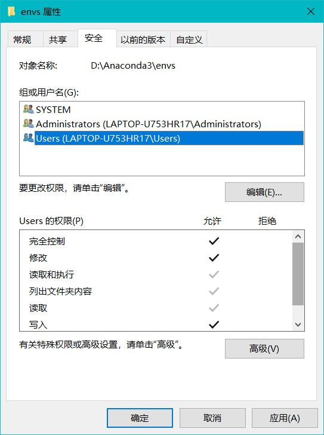

# Anaconda保姆级教程
## Anaconda的环境配置
Anaconda 是一个包括python各种包的捆绑软件。anaconda 会自动安装一个基本的 python ，该 python 的版本与 anaconda 的版本有关。该 python 下已经安装好了一大堆工具包，对于科学计算分析是十分便利的。

先找一个地方下载anaconda，附上清华镜像站链接
https://mirrors.tuna.tsinghua.edu.cn/anaconda/archive/  

### 1. 添加环境变量(加就完事了)
第一个为了Python检查正常；第二个为了conda检查正常；第四个与jupyter notebook 动态库有关
```
<path>.\Anaconda3
.\Anaconda3\Scripts
.\Anaconda3\Library\bin
.\Anaconda3\Library\mingw-w64\bin
```


### 2. 检验安装使用是否成功
`win + R` + `cmd`打开命令提示符  
或者打开 Anaconda Prompt

```
检验安装：

检验python环境：  
python 打开 Python 环境
exit()/ctrl + Z 退出 Python 环境 

检验conda工具：
conda --version 查看 conda 版本
python -- version 查看 anaconda 中基础 python 版本
conda/conda list/conda info 查看conda命令/conda环境中的包/查看conda配置
```
 

### 3. 源配置(使用命令添加源或者直接修改)  

```
有关源配置的命令：
conda config --show 显示 conda 的所有配置信息
conda config --show channels 显示 channels 源配置信息
conda config --show-sources 查看已添加的镜像源
conda config --set show_channel_urls yes 设置在下载包过程中知道包来源
conda config --add channels <urls> 添加指定镜像源
conda config --remove channels <urls> 删除指定镜像源
conda config -- remove-key channels 删除所有镜像源恢复默认
```
(1) 找到.condarc文件（这个文件是 user config file）
输入 `conda info` 可以找到该文件位置(我这里在 C 盘)
(2) 用记事本打开后编辑输入（以下源为清华大学开源软件镜像站）：

```
channels:
  - defaults
show_channel_urls: true
channel_alias: https://mirrors.tuna.tsinghua.edu.cn/anaconda
default_channels:
  - https://mirrors.tuna.tsinghua.edu.cn/anaconda/pkgs/main
  - https://mirrors.tuna.tsinghua.edu.cn/anaconda/pkgs/free
  - https://mirrors.tuna.tsinghua.edu.cn/anaconda/pkgs/r
  - https://mirrors.tuna.tsinghua.edu.cn/anaconda/pkgs/pro
  - https://mirrors.tuna.tsinghua.edu.cn/anaconda/pkgs/msys2
custom_channels:
  conda-forge: https://mirrors.tuna.tsinghua.edu.cn/anaconda/cloud
  msys2: https://mirrors.tuna.tsinghua.edu.cn/anaconda/cloud
  bioconda: https://mirrors.tuna.tsinghua.edu.cn/anaconda/cloud
  menpo: https://mirrors.tuna.tsinghua.edu.cn/anaconda/cloud
  pytorch: https://mirrors.tuna.tsinghua.edu.cn/anaconda/cloud
  simpleitk: https://mirrors.tuna.tsinghua.edu.cn/anaconda/cloud
```

### 4. 修改 jupyter 工作路径
1. 打开Anaconda Prompt，输入命令找到jupyter配置文件位置
  `jupyter notebook --generate-config`
2. 在电脑上找到该文件后用记事本打开修改下面路径
  `## The directory to use for notebooks and kernels.`
  `c.NotebookApp.notebook_dir = 'X:\XXX...`
3. 然后打开 jupyter 快捷方式的属性
  删掉目标中的 %USERPROFILE% 并在后面添加上刚才设置好的默认工作路径
   

### 5. 修改虚拟环境保存路径
```
有关虚拟环境设置的命令：
`conda config --add <key> <value>` 修改增加配置
`conda config --remove <key> <value>` 修改删除配置
`conda config --add envs_dirs <./Anaconda3:/envs>` 增加虚拟环境默认安装路径
`conda config --remove envs_dirs <./Anaconda3:/envs>` 删除虚拟环境默认安装路径
```
如果环境仍然安装到C盘，可能是envs文件夹被设置为只读，此时勾掉只读，User权限全部设置为允许
 

### 6. 创建并管理虚拟环境
```
conda env list 查看当前存在的虚拟环境
conda info -e 查看当前存在的虚拟环境
conda create -n <envname> python=X.X 创建虚拟环境
activate <envname> 激活指定虚拟环境
conda remove -n <envname> --all 删除虚拟环境
```

### 7. 把虚拟环境作为核添加到juypter中
如果在 anaconda navigator 中为新环境装jupyter，会给开始菜单新增加一个jupyter 快捷方式

```
`jupyter kernelspec list` 查看juypter所有核
`juypter kernelspec remove <kernelname>` 卸载jupyter内核 
`python -m ipykernel install --user` 重装系统核
```
1. `conda install ipykernel` `conda install -n <envname> ipykernel` 在 jupyter 环境中增加切换核功能的依赖包
2. `python -m ipykernel install --user --name <envname> --display-name "<displayname>"` 在juypter中装环境核

### 8. juypter好用的配置（安装上就完事了）
`pip install jupyter_contrib_nbextensions` jupyter扩展程序
`pip install jupyter_nbextensions_configurator` jupyter 扩展程序
```
Hinterland 代码自动补全
Execute Time 显示执行时间
Table of Comtents 目录索引
spellchecker 拼写检查
Togg all line numbers 代码行号
```


### 9. 创建、使用和管理多个不同的 python 版本管理

```   
conda list <package_name> 查看是否有安装指定包
conda install xxx 使用conda工具安装包
conda install -n <env_name> xxx 在指定环境安装包
conda show <package_name> 查看当前环境下包的所有信息
conda uninstall xxx 使用conda工具卸载包
```
## Anaconda使用前遇到的问题
### 1. Anaconda, Miniconda, Miniforge —— conda

**Conda**

Conda是一个辅助进行包管理和环境管理的工具。目前是Ananconda默认的Python包和环境管理工具，所以安装了Ananconda完整版，就默认安装了Conda。

**Anaconda, Miniconda, Miniforge**

Anaconda 和 Miniconda 是一个公司的产品，商用是付费的，个人暂时免费；而Miniforge是由社区主导，用GitHub托管，完全免费。Miniconda 和 Miniforge 是差不多的产物，代表着轻量化，而Anaconda是完整版，就略显臃肿。

Miniconda = Python + conda (with minimal dependencies, like openssl, ncurses...)。

Anaconda = Python + conda + meta package (about 160 Python pkgs, like curl, numpy, pandas...)。


**Default Source (Anaconda, Miniconda, Miniforge)**

anaconda 的默认源是 `default`，而pip的默认源是 `PyPI (Python Package Index)`，在 PyPI 中可以发现和安装由 Python 社区开发和共享的软件包。pip 是专门针对 Python 打包而成的，属于wheels or source distributions，需要 compiler 来安装；而conda packages are binaries，因此包含例如 C 语言写的库，同时也不需要 compilers。pip的没有严格的依赖冲突检查，而conda是会有严格的依赖冲突检查。Miniforge 使用 `conda-forge` 作为默认 channel，而 Miniconda 使用 `anaconda.org` 作为默认channel。


### 2. wheels, source distributions

源发行版包含源代码，不仅包括python代码，还包含与包绑定的任何扩展模块的源代码(包括python，C++等) ，扩展模块是在用户端需要编译的。如果下载的是一个源发行版，需要先构建成轮子，才能进行安装。如果下载的是轮子，轮子比源发行版更小，能够更快的在网络中传输，也节省了构建过程的时间.`

通常我们安装一个python包，直接用`pip install <pkg-name>`就行，但如果我们想要多个python环境，也就需要用到virtualenv；同时如果这个包没有不是 Python packages，是用C语言写的；这时候就需要Conda登场了，它同时解决了以上所有问题。

### 3. conda/pip install XXX
conda install xxx 这种方式安装的库会在 `anaconda3/pkgs` 目录下放一份，在`anaconda3/envs/<current_env>/Lib/site-packages`下放一份。在这样的好处就是，当曾经下载过某个库时，就可以直接从 pkgs 目录下将该库复制到新环境而不用重复下载。

pip install xxx 这种方式安装的库会在`anaconda3/envs/<current_env>/Lib/site-packages`文件夹中，如果是单独装的 python，安装路径还要再考虑。


# 学习心得


- [x] 从国内镜像源下载包如果发生下载失败，有可能是网络波动引起，可以重复安装
- [x] 空的虚拟环境里包括python运行解释的基础包，pip和conda的环境管理包等
- [x] 如非必要一般不更新包，因为更新后的包的依赖项包也可能需要更新，导致使用时报错
- [x] 虚拟环境安装路径、安装包路径、镜像源配置文件路径、jupyter工作路径都需要配置
- [x] 基础环境一般不使用，要根据自己具体项目建立自己的环境，否则就失去了环境管理功能的意义！在基础环境的juypter中安装ipykernel包使用新环境的核，不用为新环境再装一个新的jupyter。
- [ ] 本文涉及的命令的官方参考网址后续会列出来
- [x] 2022-12-21 11:00

 

