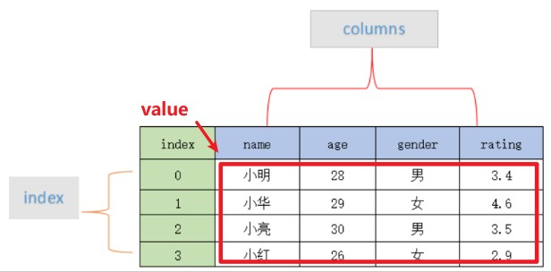
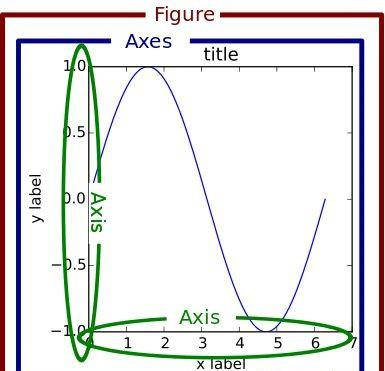

### 数据三剑客(Numpy、Pandas、matplotlib)
#### Numpy
| Funcation | Description |
| :--- | :--- |
| np.array() | 创建一个ndarry |
| np.empty() | 创建指定类型的空数组 |
| np.arange() | 创建数值范围并返回 ndarry 对象 |
| np.asarrary() | 转换类型为 ndrray 数组 |
| np.dot() | 两个数组的点积 |
| np.vdot() | 两个向量的点积 |
| np.inner() | 两个向量的内积 |
| np.matual() | 两个向量的矩阵积 |

#### Pandas
 

| Funcation | Description |
| :--- | :--- |
| DataFrame.head() | 返回表格数据的前几行便于查看数据(默认五行) |
| DataFrame.shape  | 返回表格数据的行列数目  |
| DataFrame.columns | 返回表格数据的列标识数组|  
| DataFrame.dtypes | 返回所有列标识及类型的列表|
| DataFrame.fillna(method='ffill/bfill'，axis=0/1) | 将最近一次有效数据| 沿列/沿行向前/向后填充|
| DataFrame.iloc[...,...]  | 按序号对表格数据做切片处理|
| DataFrame.loc['...','...']  | 按标签对表格数据做切片操作|
| DataFrame.isnull()  | 返回一个布尔类型表格数据|
| DataFrame.sum() | 默认轴为0逐行加和即整列加和|
| Dataframe.describe() | 返回描述性的统计数据 Series or DataFrame|
| Dataframe.value_count() | 返回包含唯一行计数的 Series|

| Funcation | Description |
| :--- | :--- |
| pd.read_csv() | 读取.csv文件为 dataframe |
| pd.to_datatime(values,format='...') | 把values按照format处理成Timestamp类 |
| pd.get_dummies(dummy_na=True) | 对非数字类型(可设置包含NaN)进行独热编码 |

#### Matplotlib
 