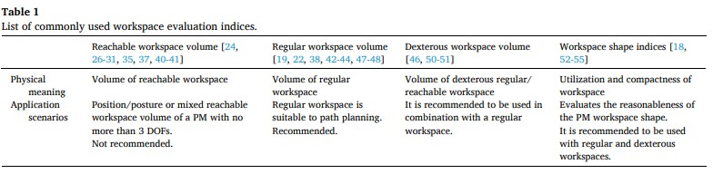
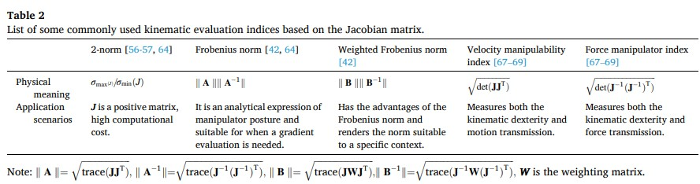
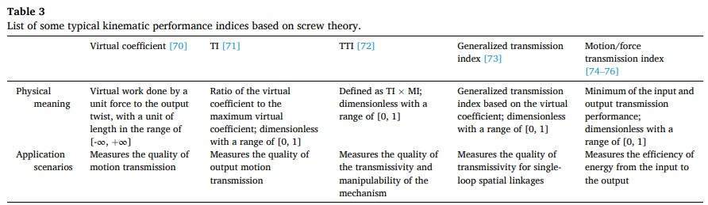
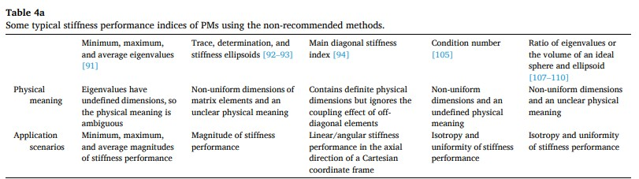
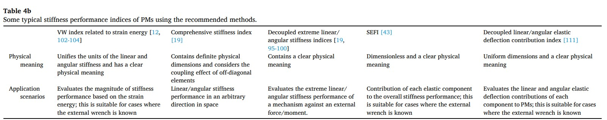
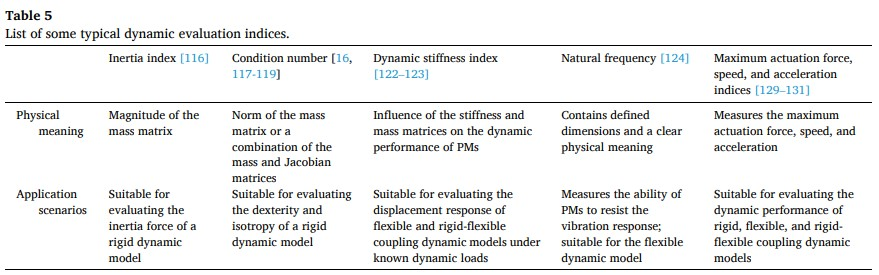
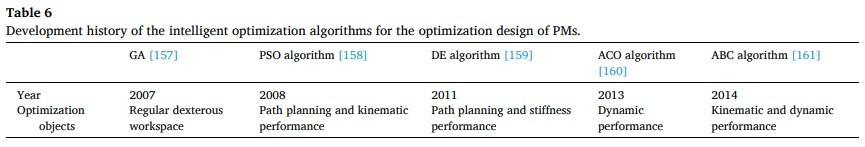
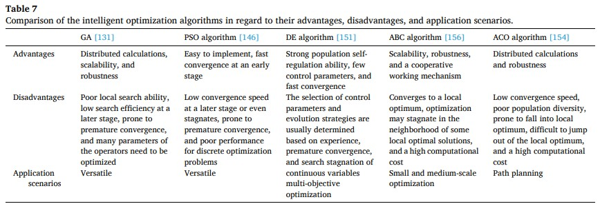

# introduction

并联机器人的性能解析主要关心**性能指标**，**优化算法**和**优化方法**。本文将深入，全面，力行的概述这三个问题。  
performance indices, optimization algorithms, optimization methods

考虑这类问题的一般方法是，相关性能指标用标量和矩阵的函数组成，这其中有雅可比矩阵，刚度和柔度矩阵，静力学和动力学中的质量矩阵。  
Jacobian matrix, stiffness and compliance matrices, and mass matrix separately formulated within the static and dynamic versions

类型综合用于提出满足现代加工技术要求的结构，尺度综合是选择性能指标、优化算法的选择，和优化方法完成的。  
type synthesis, dimensional synthesis

初步的优化设计条件是建立一个可靠的可计算的有效性能指标，它能够影响最终的工作性能和并联机构的优化设计效率。因此一些关于性能指标的的问题有：`确定一个在性能指标和优化参数之间的数学模型，探索并联机构的工作空间，运动学性能，刚度性能，动力学性能评估方法，用清晰的物理符号建立合理的性能指标`。

对于指定应用场合的机构优化选择是类型综合的重要阶段，主要部分是一个优化设计的数学模型，模型中包含设计变量，性能指标，约束函数，优化算法，以及优化结果的评估。  
design parameters, performance indices(objective functions), constraint functions, optimization algorithms, an evaluation of the optimized results

探索有效的全局的优化算法和方法用于寻找多目标整体最优解在工业上和学术上还有很多难题

本文将针对三方面给研究者们提供相关文献的参考，对存在的问题和挑战进行分析以促进相关研究的发展。  
第一部分介绍性能指标：1.1 工作空间 1.2 运动学性能 1.3 刚度性能 1.4 动力学性能 第二部分介绍优化算法：2.1 传统的优化算法 2.2 智能优化算法 2.3 改进优化算法的方法 第三部分介绍多目标优化设计方法 3.1 综合目标法 3.2 帕累托边界法 3.3 主成分分析法(PCA Principal component analysis) 最后第四部分结论和展望

# Performance indices

## Workspaces

发展有效的工具用于确定和扩大工作空间成为并联机器人研究的初步工作。并联机器人的工作空间主要考虑可达工作空间，规则工作空间和灵巧工作空间。工作空间进一步划分可分为定位置工作空间和定姿态工作空间。现在，用于求解并联机器人工作空间分析的方法主要是几何方法，数值离散方法和现代数学法。工作空间通常考虑它的形状和大小，前者包括空间利用综合指数，紧凑指数，形状指数，后者是相应工作空间体积或面积大小。  
reachable workspaces, regular workspaces, dexterous workspaces  
a position workspace (workspace with a constant posture), a posture workspace (workspace with a constant position)  
geometric methods, numerical discrete methods, modern mathematical methods
space utilization index, compactness index, shape index  
the volume or area of the reachable/regular/dexterous workspace

几何法的优点是可达工作空间的边界可以由运动闭环子链的交集得到。然而，几何法需要对每个机构建立一个集合模型，很难考虑工作空间中的空洞并且也很难计算复杂机构常规工作空间的解析表达式。

数值离散法，也叫边界法，是最常用在机构工作空间计算上，通过判断每个离散点是否满足运动学解，约束和干涉条件的方法。主要包括网格法，蒙特卡罗法，区间分析法。区间分析法的精度依赖于区间块的大小，除非区间块小于机构孔洞否则很难识别，更小的区间块只会增加工作空间计算成本。

不规则工作空间不利于轨迹规划和程序控制，在可达工作空间的边界的机构性质可能是“病态的”。主要的工作空间形式主要有圆柱形，立方形，椭圆形，球形，它们都是可达工作空间的子集。  
regular workspaces(also called useful workspaces)  
cylinders, cuboids, ellipsoids, sphere

把工作空间和雅可比矩阵的条件数结合起来形成特殊的灵巧工作空间指标。  
工作空间形状指标，界于0和1之间，通常用比例量化工作空间的大小和给定空间的大小，用来评估机构工作空间是否合理。  
Table1 展示了常用的工作空间指标去的物理意义和应用场景，便于查阅。  
建立一个工作空间解析模型，尤其是规则工作空间，或者一个低计算成本高精度的数值方法，能够极大促进并联机器人工作空间性能的衡量。同样也能提高其他性能指标的效率，例如运动学性能，刚度性能和动力学性能。  
establishing an analytical model of the workspace  
a numerical method with low computational cost and high accuracy

## Kinematic performance

运动学性能旨在获取并联机器人的运动或者力传递效率，奇异性，灵巧性，和可操纵性。运动学性能测量是必要的但在设计中仍然有需要挑战的问题。现在的运动学性能指标可以分为基于雅可比矩阵和基于螺旋理论两种。
motion/force transmission efficiency, singularity, dexterity, manipulability  
Jacobian matrix, screw theroy

建立一个运动/力性能指标，它考虑到惯性力，科里奥利力，地心引力，阻尼力，以及动力学载荷力能够更加接近并联机器人真实的运动性能。
inertial force, Corioils force, centrifugal force, damping force, dynamic load force

Table 2 列出了一些基于雅可比矩阵常用在运动学评估的指标。Table 3 列出了典型的基于螺旋理论的运动学评估的指标。

## Stiffness performance

刚度性能指标反映并联机器人在外部载荷下保持不变形的能力，反映机构的精度，尤其是承载大载荷条件下。现存的刚度性能指标考虑两类，反映刚度矩阵大小和均匀性两种性能。
accuracy of the machanism, magnitude and uniformity

Table 4a 列出了一些典型的不推荐方法获取的指标。这些指标没有考虑矩阵不均匀，直接通过刚度矩阵的数学运算获得的。Table 4b 列出了一些推荐方法的刚度指标，包含有柔性轴方法，矩阵分解方法，Schur分解法，虚功优化法，以及应变能法。
non-uniform dimensions of matrix elements  
compliant axes method, matrix decomposition method, the Schur complements-based method, the virtual work optimization method, strain energy method

需要强调的是刚度性能指标是无量纲的，而且独立于坐标系有着明确的物理意义。现有的刚度指标忽略了机构的重力和摩擦对机构的影响。因此建立刚度指标考虑每个因素，包括重力，摩擦力，和机构的灵活性，对于有效提高机构的整体刚度性能和误差补偿具有重要意义。整体刚度/柔度矩阵在力和力矩同时作用下的解耦也是其中一
有待解决的问题。

## Dynamic performance

常用的动力学评估指标主要考虑惯性指标，动力学灵巧性指标，动力学可操纵性指标，动力学刚度指标，以及自然频率指标。前三个指标主要用于评估刚性并联机器人动力学性能，后两个指标用于评估柔性并联机器人动力学性能。
inertia index, dynamic dexterity index, dynamic manipulability index, dynamic stiffness index, and natural frequency index

Table 5 展示了一些并联机器人的典型动力学评估性能指标。

## Summary

上述的运动学性能指标、刚度性能指标和动力学性能指都可以认为是局部性能指标(IPIs)。未来的性能评价研究趋势应建立具有明确物理意义的解耦性能指标，并考虑摩擦、动载荷和重力的影响。在工作空间中的均值或者不同工作空间的差异，常用作评估并联机器人的全局性能指标(GPIs)。但因为难以获得工作空间的解析表达式，GPIs 通常采用数值离散方法求解。那么 GPIs 的精度与工作空间中离散点的数目有关，这将消耗计算时间;因此，GPIs 不利于机构的性能评价和优化设计。因此，GPIs 的评估问题主要包括工作空间(特别是规则工作空间)的解析表达，以及可用的高精度、低成本的数值计算方法。
local performance indices(IPIs), global performance indices(GPIs)  
analytical of workspaces(especially regular workspaces)  
the availability of high-precision and low-cost numerical calculation methods

# Optimization algorithm

## Traditional optimization algorithms

传统优化算法一般用于结构化问题例如线性规划和二次型规划，带有或者不带有约束。大多数这类方法属于凸优化的范畴。换句话说，这些方法只有一个特定的全局最优解。
linear programming and quadratic programming, convex optimization

常用在并联机器人优化设计的传统算法主要有，穷尽算法，梯度下降算法，牛顿法，类牛顿法，共轭梯度法，连续二次规划法(SQP)。
exhausted search algorithm, the gradient desent method, Newton's method, the conjugate gradient method, the sequential quadratic programming(SQP) algorithm.

SQP算法的优点包括高计算效率，好的收敛性，一个强的边界搜索能力，因此，这个算法收到了很大的关注并被用在工程实际当中。
high computational efficiency, good convergence, a strong boundary search ability

传统优化算法的缺点在于(a)它们只能找到优化问题的局部最优解(b)优化结果与初始值强相关并且只适用于小的或者中等尺度的优化问题(c)它们很难用于多目标优化设计。

## Intelligent optimization algorithms

智能优化算法通常用在多目标优化设计上，主要考虑遗传算法，粒子群算法，差分进化算法，人工蜂群算法，蚁群算法，以及混合算法。
genetic algorithm(GA), particle swarm optimization(PSO) algorithm, the differential evolution(DE) algorithm, altificial bee colony(ABC) algorithm, the colony optimization(ACO) algorithm and hybird algorithm

由于遗传算法在实际应用中很容易出现提前收敛，因此，研究一种保留优良个体和多样性的遗传算法一直是遗传算法的一个挑战。同样，PSO算法经常遇到提前收敛和差的收敛性能对于高维问题，因此，不能保证收敛到全局最优。

上述提及的优化方法应用于并联机器人优化设计当中和相关的优化目标展示在 Table 6。Table 7 简要的概括了每种智能优化算法的优点，缺点，及应用场景。

当前主要的任务时发展能够增加种群大小而不会增加巨大的计算时间成本的方法。

## Ways to improve optimization design eficiency

许多研究者都研究方法去提高并联机器人优化设计的效率，经过几年的发展，这些方法主要有蒙特卡洛方法，性能图谱，模型映射方法和灵敏性分析方法。
Monte Carlo method, performance atlases, mapping model method, sensitivity analysis method

常用的建立映射模型主要考虑有多元回归，搞死回归，和反向传播神经网络。
multivariate regression(MR), Gaussian process regression(GPR), backpropagation(BP) neural networks

建立在GPIs和设计变量之间的映射模型是目前主要的提高并联机器人多目标优化设计效率的主要方法。

灵敏性分析的目的是确定主要或次要参数对性能评估函数的影响，以便通过减少设计参数数量，来提高优化设计效率，但目前在这方面的究报道较少，因此，未来的研究中应有更多优化设计中灵敏性分析的内容。

## Summary

# Classification of multi-objective optimization methods

目前，有三种方法用于多目标优化设计：全面综合目标，帕累托边界，主成分分析法。
the comprehensive objective, Pareto frontier, principal component analysis(PCA) methods。

# Conclusions and prospects

除了性能指标，优化算法和优化方法外，缺陷识别和修复研究旨在发现导致理论性能和实际性能差异的原因，这同样也是并联机器人性能优化的一个方向。
