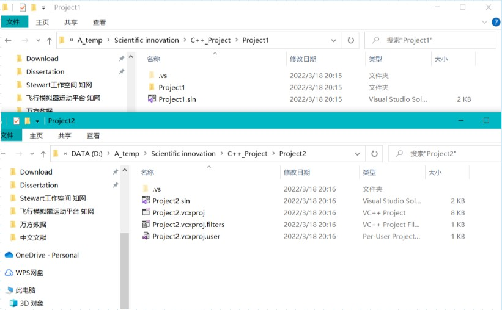
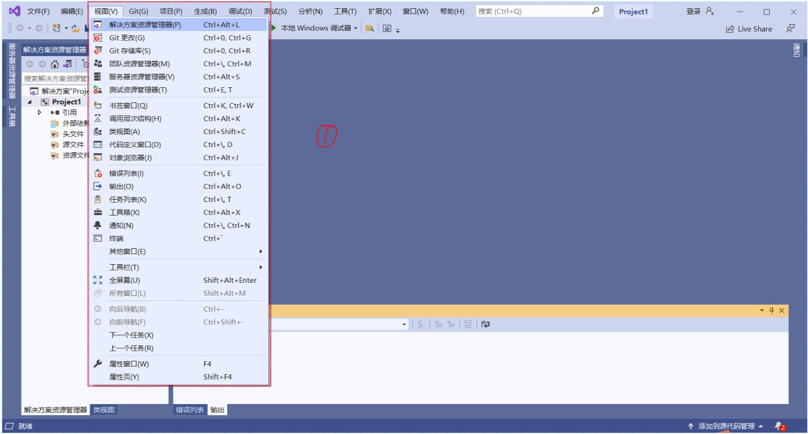
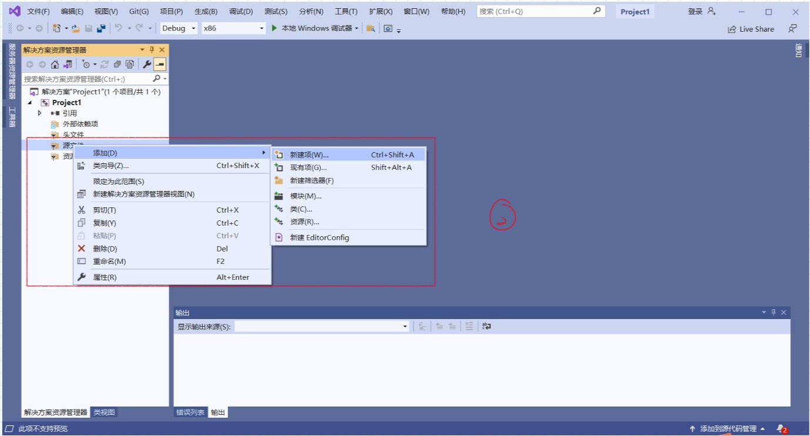
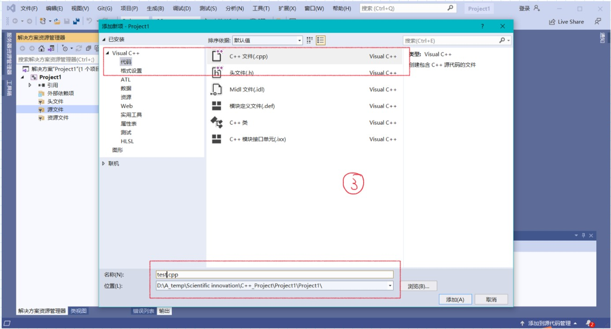
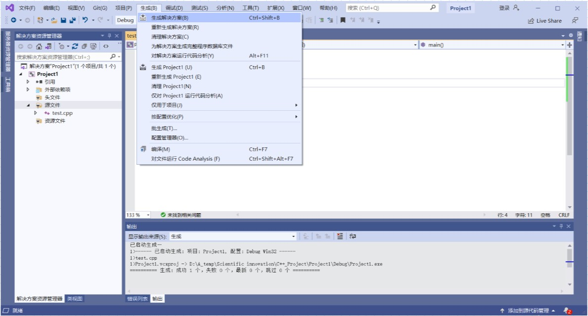
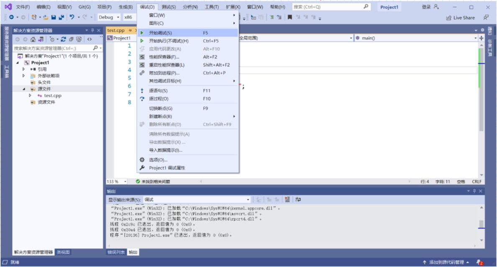

# Visual Studio 2019 的使用

## 创建新项目

![[VS1.jpg]]

![[VS2.jpg]]

一般选择创建**空项目**。**控制台应用**是一个写好的空项目(Hello World)，**Windows桌面应用程序**是一个写好的桌面窗口程序。如果想要创建一个空的桌面应用程序，可以打开**Windows桌面向导**，Windows桌面向导会再要求选择 控制台 或 桌面应用程序 并设有 空项目 勾选框，上图是选择Windows桌面向导出来的界面。

## 配置新项目

![[VS3.jpg]]

项目名称要修改为英文，修改后解决方案名称会随之改变。sln是解决方案的配置，主要是管理这个方案里的多个vcxproj。vcxproj是工程的配置文件，管理工程中细节比如包含的文件，引用库等。一般没有sln，也可以直接打开vcxproj，也可以重新生成sln。

勾选“将解决方案和项目放在统一目录中”后会改变工程文件夹中文件的存储位置

没有勾选是上图中的Project1，会有三个文件保存在Project1文件夹中；勾选是上图中的Project2，或有三个文件和.sln（工程文件）在同一目录中，如果要分享代码给别人，要发送自己编写的源代码和.sln.vcxproj两个文件

## 创建源文件

编写C++程序用到的视图主要有输出资源管理器、类视图、错误列表和输出，通过鼠标拖动布置位置，"视图"->"工具栏"可以为工具栏添加快捷图标

资源管理器中的头文件、源文件、资源文件是方便我们进行文件管理并非强制分类

这里选择"代码"->"C++文件"(.cpp)创建空文件，如果创建C语言的文件，需要把后缀改为(.c)文件。VS2019在安装时配置了C和C++的编译器，会根据文件后缀选择合适的编译器。C++头文件和源文件中只允许出现一次main函数。

## 生成编译

代码运行前编译在"生成"->"解决方案"上，当代码生成解决方案无错后，再次点击"生成解决方案"，软件会认为已经成功生成，若想再次生成需点击"重新生成解决方案"

运行位于"调试"->"开始调试（F5）"
