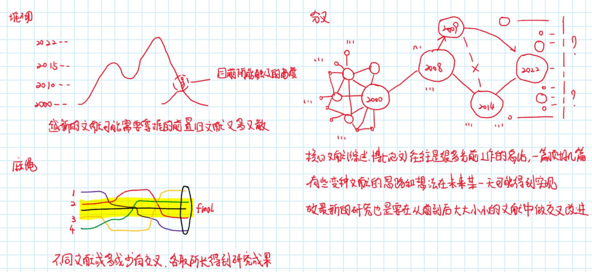
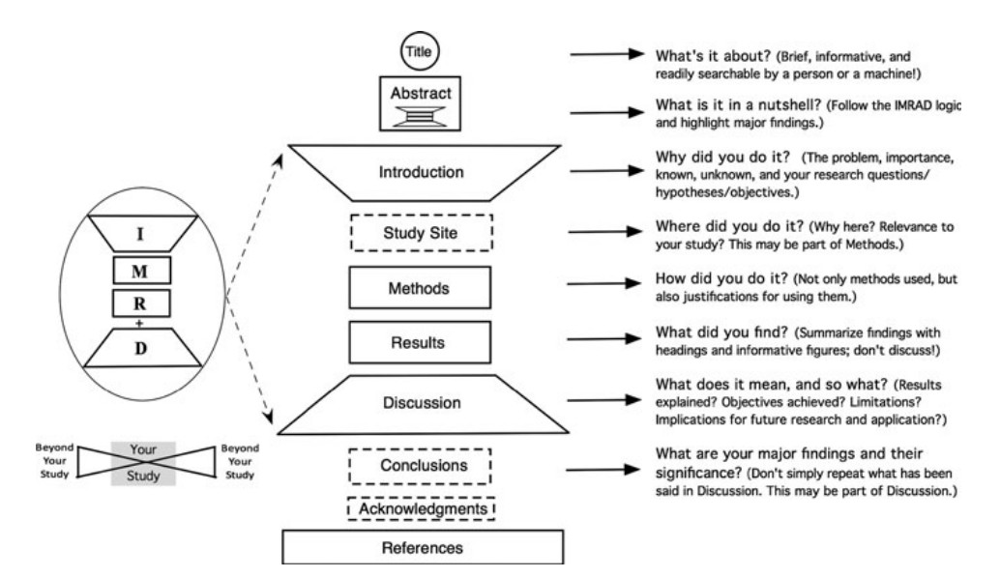

# 提高工作效率的措施

---

## 文献篇

- 搜索文献
  - 如何搜
    - 按照 不同关键词组合 相关领域大牛所有文章 搜索文献
  - 搜多少
    - 一个研究方向 大致在十篇左右 可以开始尝试做
  - 文献价值
    - 国内硕士论文 重复内容多 有效工作少 价值占比小
    - 国内博士论文 新兴内容多 有效工作多 价值占比大
    - 国内期刊文献 有价值的期刊也会发在国外 侧重结果 价值占比中
    - 国外硕博论文 有效工作多 侧重全过程 价值占比大
    - 国外期刊文献 有效工作多 侧重结果 价值占比大

    

- 阅读文献
  - 粗读 读摘要(abstract)、引言(introduction)、结论(conclusion)等
  - 细读 读文章主体，方法(methodology)、结论(results)等

    

- 文献笔记
  - 笔记工具
    - 便签/幕布 随笔 思路
    - acrobat/数位板 批注 勾画 
    - Snipaste/Onenote 截图 绘图
    - Word/VScode/Obsidian 整理笔记
    - Github/Endnote 保存笔记
  - 笔记什么
    - 文献信息：作者、单位、期刊、题目
    - 背景目的及方法：为什么这样做，是怎么做的
    - 结果与讨论：做出什么样的成果
    - 文章好在哪：比较新的点在哪
    - 自我想法：我可以借鉴的点在哪里
    - 笔记风格：用自己的话，不要机械照抄

## 学习篇

- 学习流程
  - 参考博客知乎等大佬学习的流程经验分享
  - `视频(粗学)+大佬笔记(粗理解)+书籍(细学细理解)+提纲式笔记=快速掌握`
  - 专业书 也分 工具书 和 入门理解书
- 学习资料来源
  - 老师同学推荐 书籍 视频 网站
- 学习笔记
  - 优先使用民间大佬的笔记
    - 写得完整的 可以收藏查阅
    - 写的有用的 可以提炼归纳
    - 写的要用的 可以移植更改
    - 写的复杂的 可以编写阅读须知
    - 视频 网站 同电子书籍做笔记

## 程序篇

- 编程语言语法
  - 查询 电子书籍和网站
  - 归纳 常用函数或注意要点
- 代码案例
  - 论文中的代码需要自己复现
  - 书籍中的代码要看配套资源
  - 官网中的代码要看官方文档
  - 博客中的代码要选择性利用
  - 同课题组中的代码要看学校数据库论文
- 代码阅读
  - 拿到代码逐步调试，观测中间变量结果，会更容易理解代码
- 代码改写
  - **先理解代码逻辑，再改写对应功能，最后优化结构效率**！
- 代码编写
  - 明确不同代码段要实现的功能，明确可以如何实现，再编写！
  - 优化代码时，只有在代码中重复调用的代码块，或者中间变量多且容易混淆的代码块，使用函数进行封装!
  - 函数封装优先在同一文件内封装，只有函数在多个文件中调用时单独封装到一个文件中！
- 集成开发环境
  - Python: Pycharm + Vscode + Juypter
    - 目前只用且优先用 Vscode(.py) 写足够, 涉及文档编写可以把结果转移到Juypter(.ipynb)。

## 项目篇

- 时间安排
  - 要将问题逐步细分完成
  - 同时并行任务不能太多
  - 要预留足时间做出成果
  - 遇到瓶颈尝试变换思路
- 归纳总结
  - 收获技巧要总结

# 备注

- [ ] 由于工作效率是抽象概念，总结的经验很难描述清楚，后期可以举示例或者图片等多种形式展现  
- [x] 更新时间 2023-2-12
