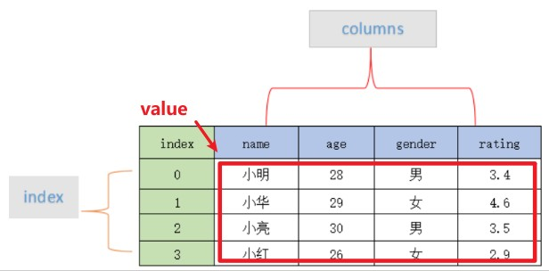

# 数据三剑客(Numpy、Pandas、matplotlib)的一些用法

### Numpy

np.asarrary() 转换输入为array类型<br>

### Pandas

<br>

DataFrame.head() 返回表格数据的前几行便于查看数据(默认五行)<br>
DataFrame.shape 返回表格数据的行列数目<br>
DataFrame.columns 返回表格数据的列标识数组<br>
DataFrame.dtypes 返回所有列标识及类型的列表<br>
DataFrame.fillna(method='ffill/bfill'，axis=0/1) 将最近一次有效数据沿列/沿行向前/向后填充<br>
DataFrame.iloc\[...,...\] 按序号对表格数据做切片处理<br>
DataFrame.loc\['...','...'\] 按标签对表格数据做切片操作<br>
DataFrame.isnull() 返回一个布尔类型表格数据<br>
DataFrame.sum()默认轴为0逐行加和即整列加和<br>
Dataframe.describe() 返回描述性的统计数据 Series or DataFrame<br>
Dataframe.value_count() 返回包含唯一行计数的 Series<br><br>

pd.read_csv() 读取.csv文件为dataframe<br>
pd.to_datatime(values,format='...') 把values按照format处理成Timestamp类<br> 
pd.get_dummies(dummy_na=True) 对非数字类型(可设置包含NaN)进行独热编码<br>


```python

```
