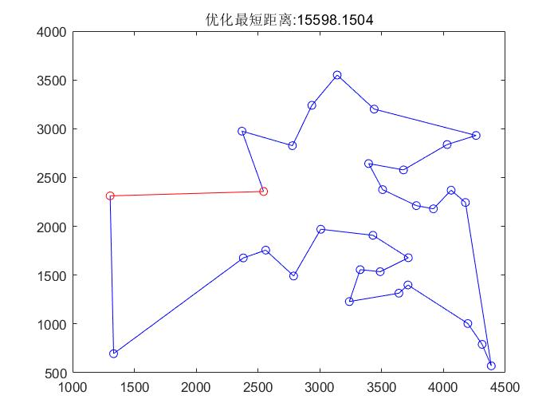
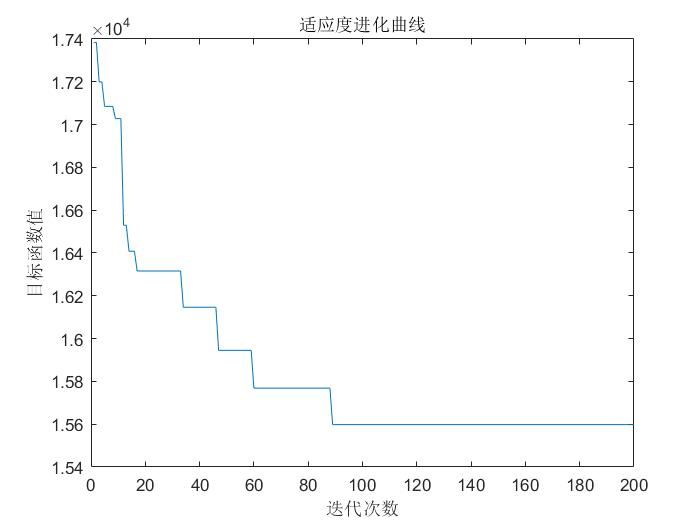

## 蚁群算法（Ant Colony Optimization, ACO）
#### 定义
蚁群算法是一种`群智能算法`，它是由一群`无智能或有轻微智能的个体`通过`相互协作`而`表现出智能行为`，从而为求解复杂问题提供了一个新的可能性。
#### 公式

#### 流程
1. 初始化。
   - 设置 蚁群规模 m 
   - 设置 迭代次数初值 Nc = 1
   - 设置 最大迭代次数 G 
   - 设置 信息素重要度因子 $\alpha$
   - 设置 启发函数重要度因子 $\beta$
   - 设置 信息素挥发因子 $\rho$ 
   - 设置 信息素增加强度系数 Q
   - 设置 有向图每条边 $(i,j)$ 的初始化信息素量 $\tau(t)=c$,其中c为常数
   - 设置 信息素增量 $\Delta\tau_{ij}(0)=0$
1. 构建解空间。
   - 各个蚂蚁随机置放在 n 个不同出发点
   - 计算蚂蚁下一实践部的访问元素，直至完成周游
     - 为每只蚂蚁生成一个`禁忌表`，储存已访问元素
     - 为每只蚂蚁生成一个可访问元素表，储存待访问元素
     - 按照`状态转移概率公式`，计算待访问元素的概率分布
     - 用`轮盘赌选择法`选取下一个元素
2. 更新信息素矩阵。
   - 计算各个蚂蚁经过的总路线长度
   - 记录当前迭代次数得到的最优解
   - 更新不同元素之间的信息素浓度
3. 判断终止。
   - 若 Nc <= G, 则 Nc = Nc + 1, 清空记录表，返回步骤 2
   - 若 Nc > G, 则终止计算，输出最优解

#### 案例一  TSP问题(旅行商问题)
假设有一个旅行商人要拜访全国 31 个省会城市，他需要选择所要走的路径，路径的限制是每个城市只能拜访一次，而且最后要回到原来出发的城市。路径的选择要求是：所选路径的路程为所有路径之中的最小值。
```MATLAB
% 蚁群算法解决TSP问题
% 初始化 
clear;                %清除所有变量
close all;                %清图
clc;                      %清屏
m = 50;                     %蚂蚁个数
Alpha = 1;                  %信息素重要程度参数              
Beta = 5;                   %启发式因子重要程度参数
Rho = 0.1;                  %信息素蒸发系数
G_max = 200;                %最大迭代次数
Q = 100;                    %信息素增加强度系数

C = [1304 2312; 3639 1315; 4177 2244; 3712 1399; 3488 1535;
     3326 1556; 3238 1229; 4196 1004; 4312 790;  4386 570;
     3007 197;  2562 175;  2788 149;  2381 167;  1332 695;
     3715 167;  3918 217;  4061 237;  3780 221;  3676 257;
     4029 283;  4263 293;  3429 190;  3507 237;  3394 264;
     3439 320;  2935 324;  3140 355;  2545 235;  2778 282;
     2370 2975
     ];

% 第一步：变量初始化 
n=size(C,1);              %n表示问题的规模（城市个数）
D=zeros(n,n);             %D表示两个城市距离间隔矩阵
for i=1:n
    for j=1:n
        if i~=j
            D(i,j)=((C(i,1)-C(j,1))^2+(C(i,2)-C(j,2))^2)^0.5;
        else
            D(i,j)=eps;

        end
        D(j,i)=D(i,j);
    end
end
Eta=1./D;                    %Eta为启发因子，这里设为距离的倒数
Tau=ones(n,n);               %Tau为信息素矩阵
Tabu=zeros(m,n);             %存储并记录路径的生成
NC=1;                        %迭代计数器
R_best=zeros(G_max,n);       %各代最佳路线
L_best=inf.*ones(G_max,1);   %各代最佳路线的长度
figure(1);
while NC<=G_max            
    % 第二步：将m只蚂蚁放到n个城市上 
    % ceil(m/n) 代表一个城市最多可同时容纳多少蚂蚁
    % Tabu 每一列 代表50只蚂蚁当前所在的城市编号
    Randpos=[];
    for i=1:(ceil(m/n))
        Randpos=[Randpos,randperm(n)];
        % randperm(n) 返回行向量，其中包含从 1 到 n 没有重复元素的整数随机排列。
    end
    Tabu(:,1) = (Randpos(1,1:m))'; 
    % 第三步：m只蚂蚁按概率函数选择下一座城市，完成各自的周游
    for j=2:n
        for i=1:m
            visited=Tabu(i,1:(j-1));  %已访问的城市
            J=zeros(1,(n-j+1));       %待访问的城市
            P=zeros(1,(n-j+1));       %待访问城市的选择概率分布
            % 按序查找没有访问的城市填入待访问城市列表
            Jc=1; 
            for k=1:n
                if isempty(find(visited==k, 1))
                    J(Jc)=k;
                    Jc=Jc+1;
                end
            end
            % 计算待访问城市的概率分布 
            for k=1:length(J)
                P(k)=(Tau(visited(end),J(k))^Alpha)*(Eta(visited(end),J(k))^Beta);
            end
            P=P/(sum(P));
            % 按概率原则选取下一个城市 
            % 根据累加概率和随机数选取城市(轮盘赌)
            Pcum=cumsum(P);
            Select=find(Pcum>=rand);
            to_visit=J(Select(1));
            Tabu(i,j)=to_visit;
        end
    end
    if NC>=2
        Tabu(1,:)=R_best(NC-1,:);
    end
    % 第四步：记录本次迭代最佳路线
    % 计算所有蚂蚁线路总长 
    % 保存所有路线最短总长为最优值
    % 保存最优值对应路线到总迭代记录表
    L=zeros(m,1);
    for i=1:m
        R=Tabu(i,:);
        for j=1:(n-1)
            L(i)=L(i)+D(R(j),R(j+1));
        end
        L(i)=L(i)+D(R(1),R(n));
    end
    L_best(NC)=min(L);
    pos=find(L==L_best(NC));
    R_best(NC,:)=Tabu(pos(1),:);
    % 第五步：更新信息素 
    % 更新所有城市之间路径上的信息素 即更新信息素矩阵
    Delta_Tau = zeros(n,n);
    for i=1:m
        for j=1:(n-1)
            Delta_Tau(Tabu(i,j),Tabu(i,j+1)) = Delta_Tau(Tabu(i,j),Tabu(i,j+1)) + Q/L(i);
        end
        Delta_Tau(Tabu(i,n),Tabu(i,1)) = Delta_Tau(Tabu(i,n),Tabu(i,1)) + Q/L(i);
    end
    Tau=(1-Rho).*Tau+Delta_Tau;
    % 第六步：禁忌表清零
    Tabu=zeros(m,n);
    % 绘制历代最优路线
    for i=1:n-1
        plot([C(R_best(NC,i),1), C(R_best(NC,i+1),1)], [C(R_best(NC,i),2), C(R_best(NC,i+1),2)],'bo-');
        hold on;
    end
    plot([C(R_best(NC,n),1), C(R_best(NC,1),1)], [C(R_best(NC,n),2), C(R_best(NC,1),2)],'ro-');  
    title(['优化最短距离:',num2str(L_best(NC))]);
    hold off;
    pause(0.005);
    NC=NC+1;    
end
% 第七步：输出结果 
Pos=find(L_best==min(L_best));
Shortest_Route=R_best(Pos(1),:);            %最佳路线
Shortest_Length=L_best(Pos(1));             %最佳路线长度
figure(2),
plot(L_best)
xlabel('迭代次数')
ylabel('目标函数值')
title('适应度进化曲线')
```

> eps是一个函数，它表示的是一个数可以分辨的最小精度。
> - 默认时它表示1到它下一个浮点数之间的距离的一半，而正好等于最大小于1的浮点数到最小大于1的浮点数之间的距离。
> - 当N越大时，eps(N)越大，eps不是一个固定的值,当它越靠近0时eps越小。
> - 由于计算机表示的浮点数不是连续的，它是离散的而且是有限的，所以用最小相对精度来区分浮点数是一个很好的做法，但是这样会产生一定的误差。越靠近0它的精度越高。

 
 

#### 思考
- [ ] 蚁群规模、迭代次数、重要度因子、挥发因子、增强系数的选择？
- [ ] 状态转移概率的方式？
- [ ] 信息素更新函数的形式？
- [ ] 改进蚁群算法：精英蚂蚁系统、最大最小蚂蚁系统、基于排序的蚂蚁算法、自适应蚂蚁算法等？
- [ ] 蚁群算法的Python写法？
- [x] 本文更新在 2022-8-18 17:00

