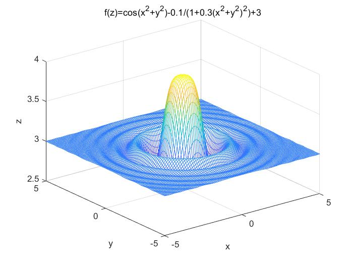
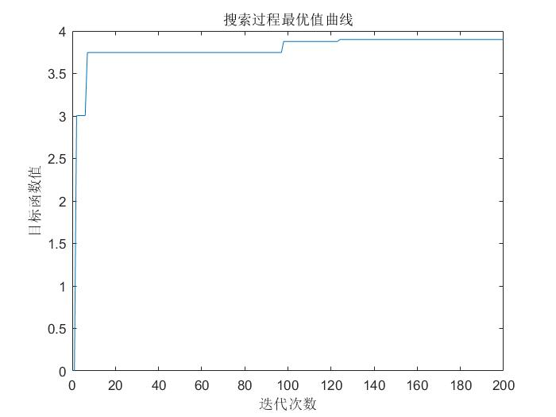

## 禁忌搜索（Tabu Search or Taboo Search，TS）
#### 定义
禁忌算法是一种`亚启发式 (meta-heuristic)随机搜索算法`，它从一个初始可行解出发，选择一系列的特定搜索方向（移动）作为试探，选择实现让特定的目标函数值变化最多的移动。
#### 概念
藐视准则
在禁忌搜索算法中，可能会出现候选解全部被禁忌，或存在一个优于最优解的候选解被禁忌，此时将解禁某些解，以实现更高效的优化性能。
#### 流程
1. 参数初始化
   - 设置 最大迭代次数
   - 设置 邻域解个数
   - 设置 禁忌表最大长度
   - 初始化 禁忌表为空
   - 初始化 当前解、最优解
2. 用当前解生成若干邻域解，并从中选取若干候选解
3. 比较当前解和候选解
   - 候选解没有优于当前解，候选解最为下一次迭代当前解，候选解加入禁忌表
   - 候选解优于当前解，称为改进解进入步骤 4
4. 改进解与最优解比较
    - 改进解优于最优解，改进解作为下一次迭代当前解，改进加入禁忌表，改进解替换为最优解
    - 改进解没有优于最优解，判断改进解是否在禁忌表
      - 不在禁忌表，改进解作为下一次迭代当前解，改进解加入禁忌表
      - 在禁忌表，当前解重新产生邻域解 
5. 判断终止条件是否满足，若不满足跳转步骤 2

#### 案例
求函数f(x,y)=(cos(x^2+y^2)-0.1)/(1+0.3(x^2+y^2)^2)+3的最大值，其中x的取值范围为[-5,5]，y的取值范围为[-5,5]，这是一个具有多个局部极值的函数。
```MATLAB
% 禁忌搜索算法求函数极值问题 
clear;                          %清除所有变量
close all;                      %清图
clc;                            %清屏
[x,y] = meshgrid(-5:0.1:5,-5:0.1:5);
f = @(x,y)(cos(x.^2+y.^2)-0.1)./(1+0.3.*(x.^2+y.^2).^2)+3;
z = f(x,y);
mesh(x,y,z);
xlabel('x');
ylabel('y');
zlabel('z');
title('f(z)=cos(x^2+y^2)-0.1/(1+0.3(x^2+y^2)^2)+3');
```

 

```MATLAB
% 初始化 
clear  ;                        %清除所有变量
clc;                              %清屏
xu = 5;                             %上界
xl = -5;                            %下界
L = randi([5 11],1,1);              %禁忌长度取5,11之间的随机数
Ca = 5;                             %邻域解个数
Gmax = 200;                         %禁忌算法的最大迭代次数；
w = 1;                              %自适应权重系数
tabu = [];                          %禁忌表
x0 = rand(1,2)*(xu-xl) + xl;        %随机产生初始解
% key 储存最优解 value 储存最优值 
bestsofar.key = x0;                 %最优解
xnow(1).key = x0;                   %当前解
bestsofar.value = func2(bestsofar.key); % 最优解值    
xnow(1).value=func2(xnow(1).key);   % 当前解值
g = 1;
while g < Gmax
    % 产生 Ca 个邻域解
    x_near=[];                     %邻域解
    w=w*0.998;
    for i=1:Ca
        x_temp = xnow(g).key;
        x1 = x_temp(1);
        x2 = x_temp(2);
        x_near(i,1) = x1 + (2*rand-1) * w * (xu-xl);
        % 边界条件处理
        % 边界吸收
        if x_near(i,1)<xl
            x_near(i,1)=xl;
        end
        if x_near(i,1)>xu
            x_near(i,1)=xu;
        end
        x_near(i,2)=x2 + (2*rand-1) * w * (xu-xl);
        % 边界条件处理
        % 边界吸收
        if x_near(i,2)<xl
            x_near(i,2)=xl;
        end
        if x_near(i,2)>xu
            x_near(i,2)=xu;
        end
        % 计算邻域解点的函数值 
        fitvalue_near(i)=func2(x_near(i,:)); 
    end

    % 最优邻域解为候选解 
    temp = find(fitvalue_near == max(fitvalue_near));
    candidate(g).key=x_near(temp,:);
    candidate(g).value=func2(candidate(g).key);
    % 候选解和当前解的评价函数差 
    delta1 = candidate(g).value - xnow(g).value; 
    % 候选解和目前最优解的评价函数差 
    delta2 = candidate(g).value - bestsofar.value;    
    % 候选解并没有改进解，把候选解赋给下一次迭代的当前解 
    if delta1 <= 0   
        xnow(g+1).key = candidate(g).key;
        xnow(g+1).value = func2(xnow(g).key);
        % 更新禁忌表 
        tabu=[tabu;xnow(g+1).key];
        % 超出禁忌长度 清空最早进禁忌表的值
        if size(tabu,1) > L  
            tabu(1,:)=[];
        end
        g = g + 1;                 %更新禁忌表后，迭代次数自增1
    % 如果相对于当前解有改进，则应与目前最优解比较 
    elseif delta2 > 0            %候选解比目前最优解优
        % 把改进解赋给下一次迭代的当前解 
        xnow(g+1).key=candidate(g).key;
        xnow(g+1).value=func2(xnow(g+1).key);
        % 更新禁忌表 
        tabu=[tabu;xnow(g+1).key];
        if size(tabu,1)>L
            tabu(1,:)=[];
        end
        % 把改进解赋给下一次迭代的目前最优解
        % 包含藐视准则
        bestsofar.key=candidate(g).key;
        bestsofar.value=func2(bestsofar.key);
        g = g + 1;                %更新禁忌表后，迭代次数自增1
    else
        % 判断改进解在禁是否在禁忌表里 
        [M,N] = size(tabu);
        r = 0;
        for m=1:M
            if candidate(g).key(1)==tabu(m,1) && candidate(g).key(2) == tabu(m,1)
                r=1;
            end
        end
        if  r==0
            % 改进解不在禁忌表里，把改进解赋给下一次迭代的当前解
            xnow(g+1).key=candidate(g).key;
            xnow(g+1).value=func2(xnow(g+1).key);
            % 更新禁忌表 
            tabu=[tabu;xnow(g).key];
            if size(tabu,1)>L
                tabu(1,:)=[];
            end
            g = g + 1;               %更新禁忌表后，迭代次数自增1
        else
            % 如果改进解在禁忌表里，用当前解重新产生邻域解 
            xnow(g).key=xnow(g).key;
            xnow(g).value=func2(xnow(g).key);
        end
    end
    trace(g)=func2(bestsofar.key);
end
fprintf("%f,%f,%f\n",bestsofar.key(1),bestsofar.key(2),bestsofar.value)        %最优变量及最优值
figure;
plot(trace);
xlabel('迭代次数');
ylabel('目标函数值');
title('搜索过程最优值曲线');

function y=func2(x)
y=(cos(x(1)^2+x(2)^2)-0.1)/(1+0.3*(x(1)^2+x(2)^2)^2)+3;
end
```

 


#### 思考
- [ ] 初始化参数的选择(禁忌表长度，当前解的初始化)？
- [ ] 当前解产生邻域解(邻域解个数，自适应权重因子)？
- [ ] 邻域解产生候选解？
- [ ] 适应度函数？
- [ ] 藐视准则和特赦原则？
- [ ] 终止条件(最大迭代次数、单个对象最大禁忌频率、偏离阈值等)？
- [ ] 与其他优化算法相结合？
- [x] 本文更新在 2022-8-21 18:30