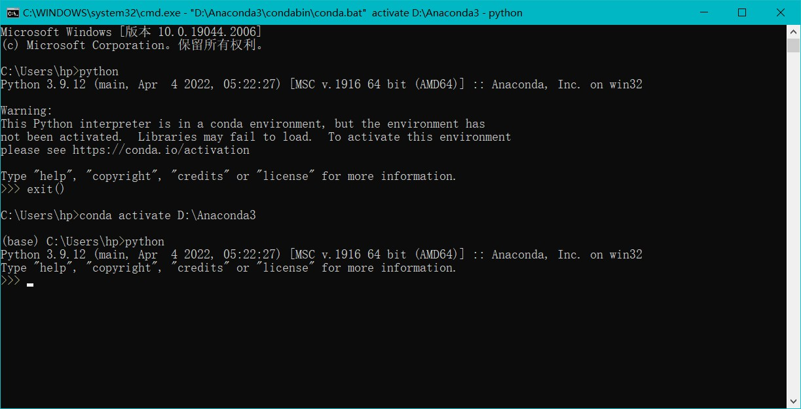
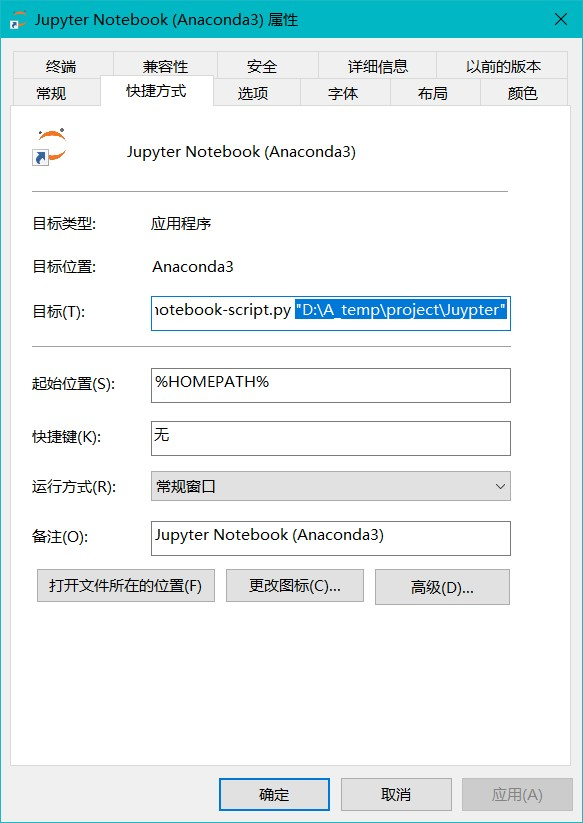

## Anaconda保姆级教程
#### anaconda的环境配置
1. Anaconda 包括是一个python各种包的捆绑软件
先找一个地方下载anaconda，附上清华镜像站链接
https://mirrors.tuna.tsinghua.edu.cn/anaconda/archive/

2. 添加环境变量(加就完事了)
`<path>.\Anaconda3` 为了Python检查正常
`.\Anaconda3\Scripts` 为了conda检查正常
`.\Anaconda3\Library\bin` 
`.\Anaconda3\Library\mingw-w64\bin` jupyter notebook 动态库

3. 检验安装使用是否成功
`win + R` + `cmd`打开命令提示符或者打开 Anaconda Prompt  
`python` + `exit()` \ `ctrl + Z` 打开 python 环境
`conda --version` 查看 conda 版本
`python -- version` 查看 anaconda 中基础 python 版本
`conda` `conda list` `conda info` 可用于检查安装是否正确
 

4. 接下来是源配置(使用命令添加源或者直接修改)
`conda config --show` 显示 conda 的所有配置信息
`conda config --show channels` 显示 channels 源配置信息
`conda config --set show_channel_urls yes` 设置在下载包过程中知道包来源
`conda config --add channels <urls>` 添加指定镜像源
`conda config --remove channels <urls>` 删除指定镜像源
`conda config -- remove-key channels` 删除所有镜像源恢复默认
找到.condarc文件（这个文件是 user config file）
输入 `conda info` 可以找到该文件位置(我这里在 C 盘)
用记事本打开后编辑输入：清华大学开源软件镜像站
    ```
    channels:
      - defaults
    show_channel_urls: true
    channel_alias: https://mirrors.tuna.tsinghua.edu.cn/anaconda
    default_channels:
      - https://mirrors.tuna.tsinghua.edu.cn/anaconda/pkgs/main
      - https://mirrors.tuna.tsinghua.edu.cn/anaconda/pkgs/free
      - https://mirrors.tuna.tsinghua.edu.cn/anaconda/pkgs/r
      - https://mirrors.tuna.tsinghua.edu.cn/anaconda/pkgs/pro
      - https://mirrors.tuna.tsinghua.edu.cn/anaconda/pkgs/msys2
    custom_channels:
      conda-forge: https://mirrors.tuna.tsinghua.edu.cn/anaconda/cloud
      msys2: https://mirrors.tuna.tsinghua.edu.cn/anaconda/cloud
      bioconda: https://mirrors.tuna.tsinghua.edu.cn/anaconda/cloud
      menpo: https://mirrors.tuna.tsinghua.edu.cn/anaconda/cloud
      pytorch: https://mirrors.tuna.tsinghua.edu.cn/anaconda/cloud
      simpleitk: https://mirrors.tuna.tsinghua.edu.cn/anaconda/cloud
    ```

5. 修改 jupyter 工作路径
  打开Anaconda Prompt，输入命令找到jupyter配置文件位置
  `jupyter notebook --generate-config`
  在电脑上找到该文件后用记事本打开修改下面路径
  `## The directory to use for notebooks and kernels.`
  `c.NotebookApp.notebook_dir = 'X:\XXX...`
  然后打开 jupyter 快捷方式的属性
  删掉目标中的 %USERPROFILE% 并在后面添加上刚才设置好的默认工作路径
   


6. 修改虚拟环境保存路径
`conda cinfig --add envs_dirs <./Anaconda3:/envs>` 修改虚拟环境默认安装路径

#### anaconda的几大优点
1. 包含 Conda
Conda是一个辅助进行包管理和环境管理的工具。目前是Ananconda默认的Python包和环境管理工具，所以安装了Ananconda完整版，就默认安装了Conda。Conda既具有pip的包管理能力。这里需要对 conda install xxx 命令和 pip install xxx 进行区别。

   - **conda install xxx**
   这种方式安装的库都会放在 `anaconda3/pkgs` 目录下，这样的好处就是，当某个环境下已经下载好了某个库，再在另一个环境中还需要这个库时，就可以直接从 pkgs 目录下将该库复制到新环境而不用重复下载。conda 所能下载的包数量要远小于PypI，它的大部分包是 python 的，但也支持了不少非 python 语言写的依赖项。包之间有严格的依赖检查，是一个超越 python 的环境管理器，创建多个环境，环境之间相互隔离。

   - **pip install xxx**
   分两种情况，一种情况是当前 conda 环境中的 python 是 conda 安装的，和系统的不一样，那么 xxx 会被安装到`anaconda3/envs/current_env/Lib/site-packages` 文件夹中，如果当前 conda 用的是系统的 python，那么 xxx 会通常被安装到系统 python 文件夹中。PyPI是Python编程语言的软件存储库，全称为“The Python Package Index”。通过PyPI也可以发现和安装由Python社区开发和共享的软件包。

2. 安装大量工具包
anaconda 会自动安装一个基本的 python ,该 python 的版本与 anaconda 的版本有关。该 python 下已经安装好了一大堆工具包，对于科学计算分析是易达便利。

3. 可以创建、使用和管理多个不同的 python 版本管理

    在 Anaconda Prompt 命令提示符中常见命令(Windows环境)
    `conda --version` 查看 conda 版本
    `python -- version` 查看 anaconda 基础 python 版本
    `conda` `conda list` `conda info` 可用于检查安装是否正确
    
    `conda config --add <key> <value>` 修改增加配置
    `conda config --remove <key> <value>` 修改删除配置
    `conda config --show-sources` 查看已添加的镜像源

    `conda env list` `conda info -e` 查看当前存在的虚拟环境
    `conda install xxx` 使用conda工具安装包
    `conda install -n <envname> xxx` 在指定环境安装包
    `conda uninstall xxx` 使用conda工具卸载包
    `conda create -n <envname> python=X.X` 创建虚拟环境
    `activate <envname>` 激活指定虚拟环境
    `conda remove -n <envname> --all` 删除虚拟环境
    如果在 anaconda navigator 中为新环境装jupyter，会给开始菜单新增加一个jupyter 快捷方式

    `conda install ipykernel` `conda install -n <envname> ipykernel` 在 jupyter 环境中增加切换核功能的依赖包
    `python -m ipykernel install --user` 重装系统核
    `python -m ipykernel install --user --name <envname> --display-name "<displayname>"` 在juypter中装环境核
    `jupyter kernelspec list` 查看juypter所有核
    `juypter kernelspec remove <kernelname>` 卸载jupyter内核

    jupyter好用的配置（安装上就完事了）
    `pip install jupyter_contrib_nbextensions` jupyter扩展程序
    `pip install jupyter_nbextensions_configurator` jupyter 扩展程序
    Hinterland 代码自动补全
    Execute Time 显示执行时间
    Table of Comtents 目录索引
    spellchecker 拼写检查
    Togg all line numbers 代码行号


- [x] 从国内镜像源下载包如果发生下载失败，有可能是网络波动引起，可以重复安装
- [x] 空的虚拟环境里包括python运行解释的基础包，pip和conda的环境管理包等
- [x] 如非必要一般不更新包，因为更新后的包的依赖项包也可能需要更新，导致使用时报错
- [x] 虚拟环境安装路径、安装包路径、镜像源配置文件路径、jupyter工作路径都需要配置
- [x] 基础环境一般不使用，要根据自己具体项目建立自己的环境，否则就失去了环境管理功能的意义！在基础环境的juypter中安装ipykernel包使用新环境的核，不用为新环境再装一个新的jupyter。
- [ ] 本文涉及的命令的官方参考网址后续会列出来
- [x] 2022-9-221 14:00

 

